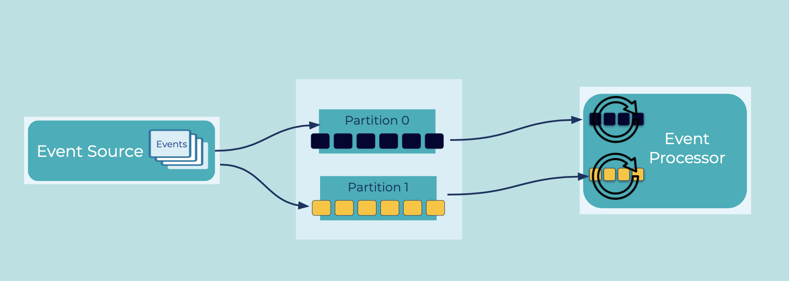

---
seo:
  title: Partitioned Placement
  description: A partition is a unit of parallelism that enables concurrent processing, and events can be written to different partitions to evenly distribute load.
---

# Partitioned Placement
If service goals mandate high throughput, it is useful to have the ability to distribute event storage and consumption for parallel processing.
Being able to distribute events and process them concurrently enables an application to scale.

## Problem
How can we allocate events across [Event Streams](../event-stream/event-streams.md) and [Tables](../table/table.md) so that they can be processed concurrently by distributed [Event Processors](../event-processing/event-processor.md)?

## Solution


You can logically group [Events](../event/event.md) at different levels to enable concurrent processing.
A partition is one unit of parallelism that helps scalability in these main ways:

* Platform scalability: enables different [Event Brokers](../event-stream/event-broker.md) to store and serve [Events](../event/event.md) to [Event Processing Applications](../event-processing/event-processing-application.md) concurrently
* Application scalability: enable different [Event Processing Applications](../event-processing/event-processing-application.md) to process [Events](../event/event.md) concurrently

## Implementation
With Apache Kafka®, topics are created either by an administrator or by a streaming application like [ksqlDB](https://ksqldb.io). Partition count is specified at the time the topic is created.
[Events](../event/event.md) are placed into a specific partition according to the partitioning algorithm of the [Event Source](../event-source/event-source.md), such as an [Event Processing Application](../event-processing/event-processing-application.md).
All events grouped into the same partition have strong ordering guarantees.

The common partitioning schemes are

1. Partitioning based on the event key (e.g., the customer ID for a stream of customer payments), where events with the same key are stored in the same partition
2. Partitioning events round-robin across all partitions to achieve an even distribution of events per partition
3. A custom partitioning algorithm, tailored to a specific use case.

If we are using ksqlDB, the processors can scale by working on a set of partitions.
If an event stream's key content changes because of how the query wants to process the rows, for example to execute a `JOIN` operation between two streams of events, the underlying keys are recalculated, and the events are sent to a new partition in the new topic to perform the computation.

```
CREATE STREAM stream_name
  WITH ([...,]
        PARTITIONS=number_of_partitions)
  AS SELECT select_expr [, ...]
  FROM from_stream
  PARTITION BY new_key_expr [, ...]
  EMIT CHANGES;
```

## Considerations
In general, a higher number of stream partitions results in higher throughput, and to maximize throughput, we want enough partitions to utilize all distributed instances of an [Event Processor](../event-processing/event-processor.md) (e.g., servers in a ksqlDB cluster).
Be sure to choose the partition count carefully based on the throughput of [Event Sources](../event-source/event-source.md) (e.g., producers in Kafka, including connectors), [Event Processors](../event-processing/event-processor.md) (e.g., ksqlDB, Kafka Streams applications), and [Event Sinks](../event-sink/event-sink.md) (e.g., consumers in Kafka, including connectors), and to benchmark performance in the environment.
Also take into consideration the design of data patterns and key assignments so that events are distributed as evenly as possible across the stream partitions.
This will prevent certain stream partitions from getting overloaded relative to other stream partitions. See [Streams and Tables in Apache Kafka: Elasticity, Fault Tolerance, and Other Advanced Concepts](https://www.confluent.io/blog/kafka-streams-tables-part-4-elasticity-fault-tolerance-advanced-concepts/) for further details on understanding and dealing with partition skew.

## References
* The blog post [How to choose the number of topics/partitions in a Kafka cluster](https://www.confluent.io/blog/how-choose-number-topics-partitions-kafka-cluster) provides helpful guidance for selecting partition counts for your topics.
* For another approach to processing parallelism that subdivides the unit of work from a partition down to an event or an event key, see the [Confluent Parallel Consumer for Kafka](https://github.com/confluentinc/parallel-consumer).
