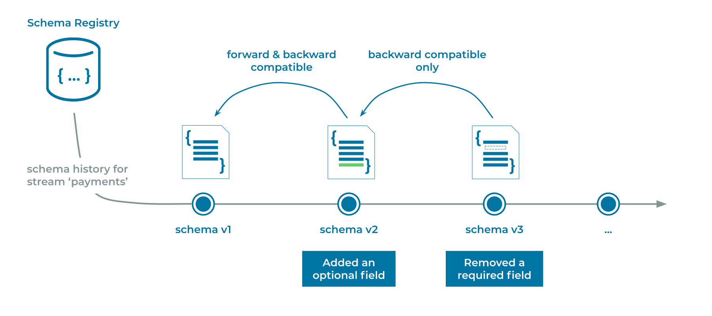

---
seo:
  title: Schema Compatibility
  description: Schema Compatibility ensures that events can evolve their schemas so that old and new versions can still be processed by downstream applications
---

# Schema Compatibility
Schemas are like [Data Contracts](../event/data-contract.md) in that they set the terms that guarantee applications can process the data they receive.
A natural behavior of applications and data schemas is that they evolve over time, so it's important to have a policy about how they are allowed to evolve and what compatibility rules are between old and new versions.

## Problem
How do we ensure that schemas can evolve without breaking existing [Event Sinks](../event-sink/event-sink.md) (readers) and [Event Sources](../event-source/event-source.md) (writers), including [Event Processing Applications](../event-processing/event-processing-application)?

## Solution


There are two types of compatibility to consider: backwards compatibility and forwards compatibility.

Backwards compatibility ensures that newer _readers_ can update their schema and still consume events written by older writers.
The types of backwards compatible changes include:

* deletion of fields: old writers can continue to include this field, new readers ignore it
* addition of optional fields with a default value: old writers do not write this field, new readers use the default value

Forwards compatibility ensures that newer _writers_ can produce events with an updated schema that can still be read by older readers.
The types of forwards compatible changes include:

* addition of fields: new writers include this field, old readers ignore it
* deletion of optional fields with a default value: new writers do not write this field, old readers use the default value

## Implementation
Using Avro as the [serialization format](../event/event-serializer.md), if the original schema is:

```
{"namespace": "io.confluent.examples.client",
 "type": "record",
 "name": "Event",
 "fields": [
     {"name": "field1", "type": "boolean", "default": true},
     {"name": "field2", "type": "string"}
 ]
}
```

Examples of compatible changes would be:

1. _Removal of a field that had a default_: notice `field1` is removed

```
{"namespace": "io.confluent.examples.client",
 "type": "record",
 "name": "Event",
 "fields": [
     {"name": "field2", "type": "string"}
 ]
}
```

2. _Addition of a field with a default_: notice `field3` is added with a default value of 0.

```
{"namespace": "io.confluent.examples.client",
 "type": "record",
 "name": "Event",
 "fields": [
     {"name": "field1", "type": "boolean", "default": true},
     {"pame": "field2", "type": "string"},
     {"pame": "field3", "type": "int", "default": 0}
 ]
}
```

## Considerations
We can use a [fully-managed Schema Registry](https://docs.confluent.io/cloud/current/get-started/schema-registry.html) service with built-in compatibility checking, so that we can centralize our schemas and check compatibility of new schema versions against previous versions.

```
curl -X POST --data @filename.avsc https://<schema-registry>/<subject>/versions
```

Once we updated our schemas and asserted the desired compatibility level, we must be thoughtful about the order of upgrading the applications that use them.
In some cases we should upgrade writer applications first (Event Sources, i.e., consumers), in other cases we should upgrade reader applications first (Event Sinks and Event Processors, i.e., producers).
See [Schema Compatibility Types](https://docs.confluent.io/platform/current/schema-registry/avro.html#compatibility-types) for more details.

## References
* [Event Serializer](../event/event-serializer.md): encode events so that they can be written to disk, transferred across the network, and generally preserved for future readers
* [Schema-on-Read](../event/schema-on-read.md): enable the reader of events to determine which schema to apply to the Event that is processed
* [Schema evolution and compatibility](https://docs.confluent.io/platform/current/schema-registry/avro.html): backward, forward, full
* [Working with schemas](https://docs.confluent.io/cloud/current/client-apps/schemas-manage.html): creating, editing, comparing versions
* [Maven plugin](https://docs.confluent.io/platform/current/schema-registry/develop/maven-plugin.html#schema-registry-test-compatibility) to test for schema compatibility during the development cycle
