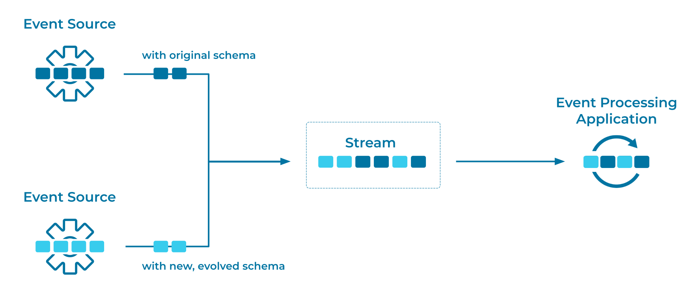
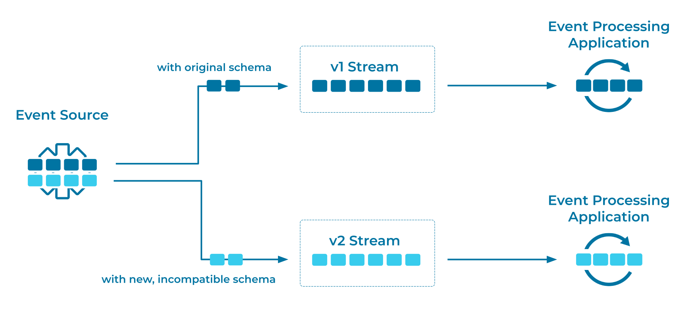

---
seo:
  title: Schema Evolution
  description: Schema Evolution adds new information to, or restructures, an Event.
---

# Schema Evolution
Schema Evolution is an important aspect of data management.
Similar to how APIs evolve and need to be compatible with all applications that rely on older or newer API versions, schemas also evolve, and likewise need to be compatible with all applications that rely on older or newer schema versions.

## Problem
How can I restructure or add new information to an event, ideally in a way that ensures [Schema Compatibility](schema-compatibility.md)?

## Solution


One approach in evolving a schema is to evolve the schema "in place" (as illustrated above). In this approach, a stream can contain events that use new and previous schema versions. The schema compatibility checks then ensure that [Event Processing Applications](../event-processing/event-processing-application.md) and [Event Sinks](../event-sink/event-sink.md) can read schemas in both formats.



Another approach is to perform _dual schema upgrades_, also known as creating _versioned streams_ (illustrated above). This approach is especially useful when you need to introduce breaking changes into a stream's schema(s) and the new schema will be incompatible with the previous schema. Here, [Event Sources](../event-source/event-source.md) write to two streams:

1. One stream that uses the previous schema version, such as `payments-v1`.
2. Another stream that uses the new schema version, such as `payments-v2`.

Event Processing Applications and Event Sinks then each consume from the stream that uses the schema version with which they are compatible.
After upgrading all consumers to the new schema version, you can retire the stream that uses the old schema version.

## Implementation
For "in-place" schema evolution, an [Event Stream](../event-stream/event-stream.md) has multiple versions of the same schema, and the different versions are [compatible with each other](schema-compatibility.md).
For example, if a field is removed, then a consumer that was developed to process events without this field will be able to process events that were written with the old schema and contain the field; the consumer will simply ignore that field.
In this case, if the original schema was as follows:

```
{"namespace": "io.confluent.examples.client",
 "type": "record",
 "name": "Event",
 "fields": [
     {"name": "field1", "type": "boolean", "default": true},
     {"name": "field2", "type": "string"}
 ]
}
```

Then we could modify the schema to omit `field2`, as shown below, and the event stream would then have a mix of both schema types.
If new consumers process events written with the old schema, these consumers would ignore `field2`.

```
{"namespace": "io.confluent.examples.client",
 "type": "record",
 "name": "Event",
 "fields": [
     {"name": "field1", "type": "boolean", "default": true}
 ]
}
```

_Dual schema upgrades_ involve breaking changes, so the processing flow needs to be more explicit: clients must only write to and read from the Event Stream that corresponds to the schema that they can process.
For example, an application that can process a v1 schema would read from one stream:

```
CREATE STREAM payments-v1 (transaction_id BIGINT, username VARCHAR)
    WITH (kafka_topic='payments-v1');
```

And an application that can process a v2 schema would read from another stream:

```
CREATE STREAM payments-v2 (transaction_id BIGINT, store_id VARCHAR)
    WITH (kafka_topic='payments-v2');
```

## Considerations
Follow [Schema Compatibility](../event-stream/schema-compatibility.md) rules to determine which schema changes are compatible and which are breaking changes.

## References
* See also the [Event Serializer](../event/event-serializer.md) pattern, in which we encode events so that they can be written to disk, transferred across the network, and generally preserved for future readers
* See also the [Schema-on-Read](../event/schema-on-read.md) pattern, which enables the reader of events to determine which schema to apply to the Event that the reader is processing.
* [Schema evolution and compatibility](https://docs.confluent.io/platform/current/schema-registry/avro.html) covers backward compatibility, forward compatibility, and full compatibility.
* [Working with schemas](https://docs.confluent.io/cloud/current/client-apps/schemas-manage.html) covers how to create schemas, edit them, and compare versions.
* The [Schema Registry Maven Plugin](https://docs.confluent.io/platform/current/schema-registry/develop/maven-plugin.html#schema-registry-test-compatibility) allows you to test for schema compatibility during the development cycle.
