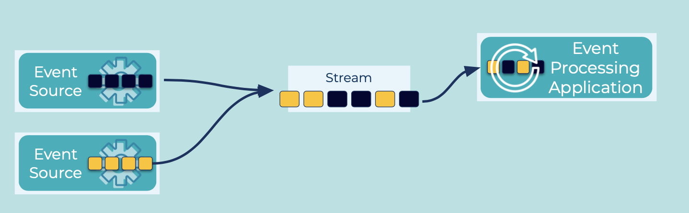
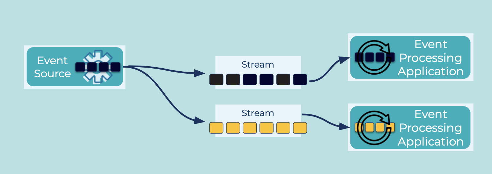

---
seo:
  title: Schema Evolution
  description: Schema Evolution involves restructuring or adding new information to an event
---

# Schema Evolution
An important aspect of data management is schema evolution.
Similar to how APIs evolve and need to be compatible for all applications that rely on old and new versions of the API, schemas also evolve and likewise need to be compatible for all applications that rely on old and new versions of a schema.

## Problem
How do I restructure or add new information to an event, ideally in a way that ensures [Schema Compatibility](schema-compatibility.md)?

## Solution


One approach for evolving a schema is "in-place" (shown above), in which a stream can have events with both new and previous schema versions in it. The schema compatibility checks then ensure that [Event Processing Applications](../event-processing/event-processing-application.md) and [Event Sinks](../event-sink/event-sink.md) can read schemas in both formats.



Another approach is _dual schema upgrades_ a.k.a. _versioned streams_ (shown above). This approach is useful especially when breaking changes in a stream's schema(s) need to be introduced; i.e., in a situation where the new schema is incompatible to the previous schema. Here, the [Event Sources](../event-source/event-source.md) write to two streams:

1. One stream with the previous schema version, e.g. `payments-v1`.
2. One stream with the new schema version, e.g. `payments-v2`.

[Event Processing Applications](../event-processing/event-processing-application.md) and [Event Sinks](../event-sink/event-sink.md) then consume from the respective stream that they are compatible with.
Once all consumers are upgraded to the new schema, the old stream can be retired.

## Implementation
For "in-place" schema evolution, an [Event Stream](../event-stream/event-stream.md) has multiple versions of the same schema that are compatible with each other.
For example, if a field is removed: a consumer that was developed to process events without this field will be able to process events written with the old schema and contain the field – the consumer will just ignore that field.
In this case, if the original schema were:

```
{"namespace": "io.confluent.examples.client",
 "type": "record",
 "name": "Event",
 "fields": [
     {"name": "field1", "type": "boolean", "default": true},
     {"name": "field2", "type": "string"}
 ]
}
```

Then you could change it to be without `field2` as show below, and the Event Stream would have a mix of both schema types.
If new consumers process events written with the old schema, they would just ignore `field2`.

```
{"namespace": "io.confluent.examples.client",
 "type": "record",
 "name": "Event",
 "fields": [
     {"name": "field1", "type": "boolean", "default": true}
 ]
}
```

For "dual schema upgrades", there are breaking changes so the processing flow needs to be more explicit such that clients are only writing to and reading from the Event Stream that corresponds to the schema that they are able to process.
For example, your Event Processing Application would read from two different streams:

```
CREATE STREAM orders-v1 (order_id BIGINT, username VARCHAR)
    WITH (kafka_topic='orders-v1');

CREATE STREAM orders-v2 (order_id BIGINT, store_id VARCHAR)
    WITH (kafka_topic='orders-v2');
```

## Considerations
Follow [Schema Compatibility](../event-stream/schema-compatibility.md) rules to determine which schema changes are compatible or breaking.

## References
* [Event Serializer](../event/event-serializer.md): encode events so that they can be written to disk, transferred across the network, and generally preserved for future readers
* [Schema-on-Read](../event/schema-on-read.md): enable the reader of events to determine which schema to apply to the Event that is processed
* [Schema evolution and compatibility](https://docs.confluent.io/platform/current/schema-registry/avro.html): backward, forward, full
* [Working with schemas](https://docs.confluent.io/cloud/current/client-apps/schemas-manage.html): creating, editing, comparing versions
* [Maven plugin](https://docs.confluent.io/platform/current/schema-registry/develop/maven-plugin.html#schema-registry-test-compatibility) to test for schema compatibility during the development cycle
