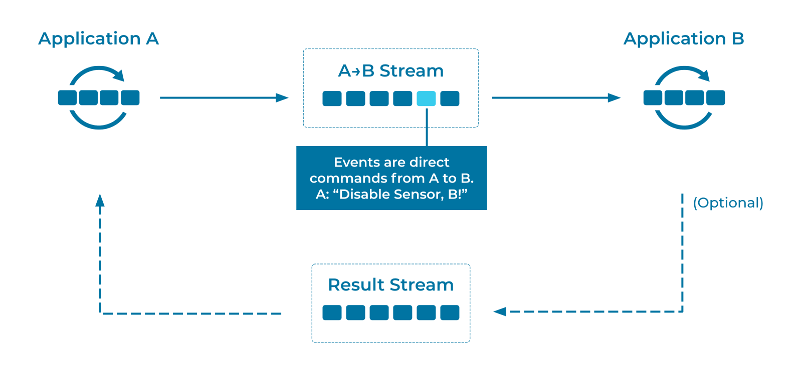
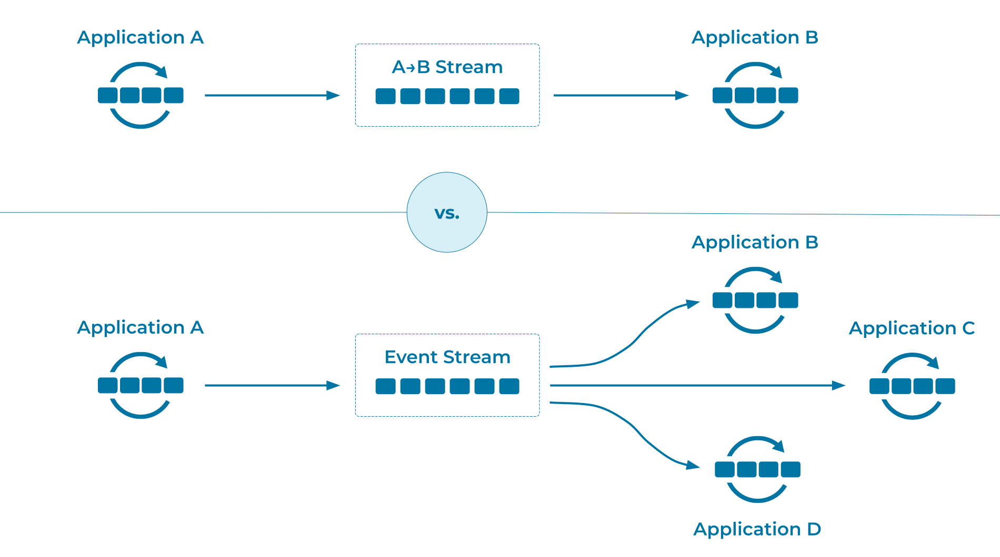

---
seo:
  title: Command
  description: Commands are a common pattern in evolving event streaming architectures, issued as an instruction to a specific recipient to perform a task. Commands may indicate opportunities for further decoupling and separation of responsibilities.
---

# Command

_Events_ pertain to facts--a user sends 
their new address, a product leaves the warehouse--and we record
these facts first, without immediately considering what happens next.

In contrast, _commands_ are for invoking a specific action--a user clicks a `[BUY]` button--and the system takes the action (for example, by triggering order processing).

## Problem

How can we use an [Event Streaming Platform](../event-stream/event-streaming-platform.md) to invoke a procedure in another application?

## Solution


One service can invoke a function call in another service through the use of an [Event Stream](../event-stream/event-stream.md). The producer service (Application A) creates a command detailing the action for the consumer service (Application B) to take. The command also includes any necessary supporting information for the execution of the command.

Commands are often issued without expecting a response beyond a simple acknowledgment of receipt by the [Event Broker](../event-stream/event-broker.md). The actual record representing the command is produced to the [Event Stream](../event-stream/event-stream.md) and stored with strong durability guarantees. The writer assumes that the command will be handled correctly by the appropriate subscriber service, and the responsibility for monitoring and error-handling falls elsewhere in the system. This is very similar to the Actor model:

1. Actors have an inbox.
2. Clients write messages to the inbox. 
3. Actors process the messages in due course.

If the producer requires an explicit response value, the consuming service can
write a result record back to a second event stream. Correlation of the issued command
with its response record is typically performed using a
[Correlation Identifier](../event/correlation-identifier.md) .

## Implementation

Suppose that we have a `[BUY]` button that should trigger a
`dispatchProduct(12005)` function call in our warehousing
system. Rather than calling the function directly, we can split the
call up. We create a command stream:

```sql
CREATE STREAM dispatch_products (
  order_id BIGINT KEY,
  address VARCHAR
) WITH (
  KAFKA_TOPIC = ' dispatch_products',
  VALUE_FORMAT = 'AVRO',
  PARTITIONS = 2
);
```

We start a process that inserts into the stream:

```sql
INSERT INTO dispatch_products ( order_id, address ) VALUES ( 12004, '1 Streetford Road' );
INSERT INTO dispatch_products ( order_id, address ) VALUES ( 12005, '2 Roadford Avenue' );
INSERT INTO dispatch_products ( order_id, address ) VALUES ( 12006, '3 Avenue Fordstreet' );
```

And finally, we start a second process that watches the stream of events and invokes the `dispatchProduct` procedure `foreach`:

```java
    ...
    Serde<GenericRecord> valueGenericAvroSerde = ...
    StreamsBuilder builder = new StreamsBuilder();

    KStream<Long, GenericRecord> dispatchStream = builder.stream(
      "dispatch_products",
      Consumed.with(Serdes.Long(), valueGenericAvroSerde)
    );

    dispatchStream.foreach((key, value) -> warehouse.dispatchProduct(key, value));
```

## Considerations

This approach works, but it may indicate a missed opportunity to improve the overall architecture of the system.

Consider what happens when we need more actions. Suppose that `[BUY]`
should also trigger an email and a text notification to the customer.
Should the warehouse software finish its work and then write
`SendEmail` and `SendText` commands to two new topics? Or should
these two new events be written by the same process that wrote `DispatchProduct`?  
A month later, when we need our sales figures, should we count the number of products dispatched, or the number of emails sent?  Should we count both, to verify that they agree?  The system grows a little more, and we have to ask, "How much code is behind that `[BUY]` button?  What's the release cycle?  Is changing it becoming a blocker?" The `[BUY]` button is important to the whole company, and rightly so, but its maintenance shouldn't hold the company to ransom.

The root problem here is that, in moving from a function call within a
monolith to a system that posts a specific command to a specific
recipient, we've decoupled the function call _without_ decoupling the
underlying concepts. When we do that, the architecture responds with
growing pains<sup>1</sup>.

A better solution is to realize that our command is actually two
concepts woven together: "What happened?" and "Who needs to know?" 

By teasing those concepts apart, we can clean up our architecture. We
allow one process to focus on recording the facts of what happened,
while other processes decide for themselves if they care about those facts.  
When the `[BUY]` click happens, we should just write an `Order`
event. Then warehousing, notifications, and sales can choose to react,
without any need for coordination.



In short, commands are tightly coupled to an audience of one, whereas
an event is simply a decoupled fact, available for anyone 
interested. Commands are not a bad pattern _per se_, but they are an indicator of strong coupling,
and may signal an opportunity for further decoupling.

Seeing systems in this way requires a slight shift of perspective--a new
way of modeling our processes--and opens up the opportunity for
systems that collaborate more easily while actually taking on less
individual responsibility.

## References

* This approach can become complex if there is a chain of functions,
  where the result of one is fed into the arguments of the next. In
  that situation, consider using [Event
  Collaboration](../compositional-patterns/event-collaboration.md).
* See [Designing Event Driven
  Systems](https://www.confluent.io/designing-event-driven-systems/)--in particular, chapter 5, "Events: A Basis for Collaboration"--for further
  discussion.
* This pattern is derived from [Command
  Message](https://www.enterpriseintegrationpatterns.com/patterns/messaging/CommandMessage.html)
  in _Enterprise Integration Patterns_, by Gregor Hohpe and Bobby Woolf.

## Footnotes

<sup>1</sup> _At this point, someone in the team will say, "We were
better off just calling the function directly."  And if we stopped
there, they would have a fair point._
