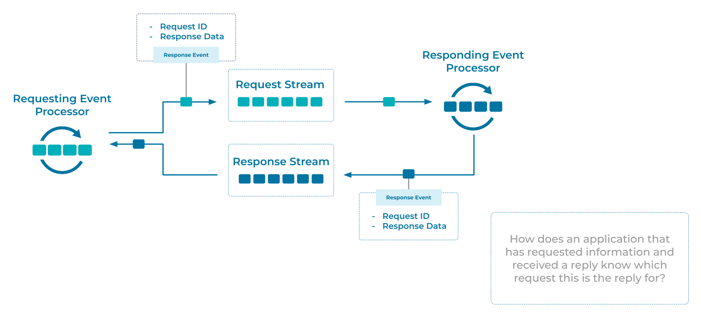

---
seo:
  title: Correlation Identifier
  description: Correlation Identifiers can be used to enable request response protocols on top of Event Streaming platforms, like Apache Kafka®
---
# Correlation Identifier
[Event Processing Applications](../event-processing/event-processing-application.md) may want to implement an [Event Collaboration](../compositional-patterns/event-collaboration.md) pattern where [Events](../event/event.md) are used to transport requests and responses. The applications which collaborate via the [Events](../event/event.md), will need a method for correlating [Event](../event/event.md) response data for specific requests.

## Problem
How does an application, that has requested information and received a response, know for which request a particular response is for?

## Solution


An Event Processor generates an Event which acts as the request. A globally unique identifier is added to the request Event prior to sending. This allows the responding Event Processor to include the identifier in the response Event, allowing the requesting processor to correlate the request and response.

## Implementation
In Kafka, we can add a globally unique identifier to the Kafka record headers when producing the request event. The following code example uses Kafka's Java producer client.
```Java
ProducerRecord<String, String> requestEvent = new ProducerRecord<>("request-event-key", "request-event-value"); 
requestEvent.headers().add("requestID", UUID.randomUUID().toString());
requestEvent.send(producerRecord);
```

In the responding event processor, we first extract the correlation identifier from the request event (here, `requestID`) and then add the identifier to the response event.
```Java
ProducerRecord<String, String> responseEvent = new ProducerRecord<>("response-event-key", "response-event-value"); 
requestEvent.headers().add("requestID", requestEvent.headers().lastHeader("requestID").value());
requestEvent.send(producerRecord);
```

## References
* This pattern is derived from [Correlation Identifier](https://www.enterpriseintegrationpatterns.com/patterns/messaging/CorrelationIdentifier.html) in Enterprise Integration Patterns by Gregor Hohpe and Bobby Woolf
* For a case study on coordinating microservices towards higher level business goals, see [Building a Microservices Ecosystem with Kafka Streams and ksqlDB](https://www.confluent.io/blog/building-a-microservices-ecosystem-with-kafka-streams-and-ksql/)
* Correlation Identifiers can be used as part of [Event Collaboration](../compositional-patterns/event-collaboration.md), a pattern in which decentralized Event Processing Applications collaborate to implement a distributed workflow solution.
* The idea of tagging requests and their related responses exists in many other protocols. For example, an email [client connecting over IMAP](https://datatracker.ietf.org/doc/html/rfc3501#section-2.2.1) will send commands prefixed with a unique ID (typically, `a001`, `a002`, etc.) and the server will respond asynchronously, tagging its responses with the matching ID.
