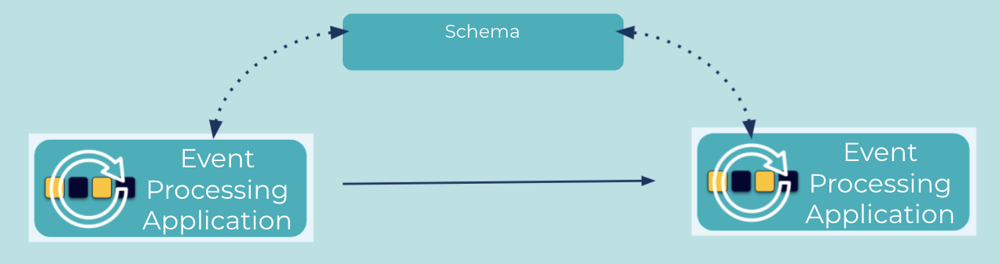

---
seo:
  title: Data Contract
  description: The Data Contract pattern allows for a an Event Processing Application to send an event to another application and the receiver will know how to process it.
---

# Data Contract 

An [Event Processing Application](../event-processing/event-processing-application.md) can send an [Event](../event/event.md) to another [Event Processing Application](../event-processing/event-processing-application.md).  It's essential that the communicating [Event Processing Applications](..event-processing/event-processing-application.md) can understand how to process these shared [Events](../event/event.md).


## Problem
How can an application send an [Event](../event/event.md) such that a receiving application will know how to process it?

## Solution


Using a Data Contract or Schema, different [Event Processing Applications](../event-processing/event-processing-application.md) can share [Events](../event/event.md) and understand how to process them without either the sender or receiver to know any details of the other.  The Data Contract pattern allows these different applications to cooperate while remaining loosely coupled thus insulated from any internal changes they may implement.

## Implementation

By using a schema to modeling event objects the client libraries of Apache Kafka (R) (Producer, Consumer, Kafka Streams) or the streaming database ksqlDB can understand how to handle events from different applications using the same schema.

```json
{
  "type":"record",
  "namespace": "io.confluent.developer.avro",
  "name":"Purchase",
  "fields": [
    {"name": "item", "type":"string"},
    {"name": "amount", "type": "double"},
    {"name": "customer_id", "type": "string"}
  ]
}
```

Additionally, using a central repository like [Schema Registry](https://docs.confluent.io/platform/current/schema-registry/index.html) makes is seamless for Kafka clients leverage schemas.

## Considerations

Rather than implementing custom support for a data-contract or schemas, you should consider using in industry accepted framework for schema support such as the following:

* [Avro](https://avro.apache.org/docs/current/spec.html) 
* [Protobuf](https://developers.google.com/protocol-buffers)
* [JSON schema](https://json-schema.org/).

## References
* [Why use Schema Registry](https://www.confluent.io/blog/schema-registry-kafka-stream-processing-yes-virginia-you-really-need-one/)