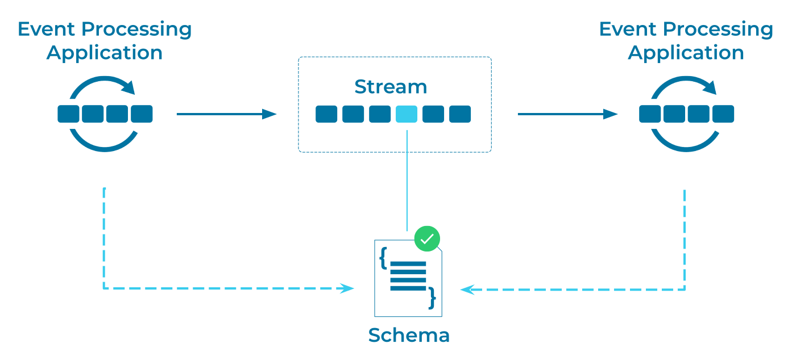

---
seo:
  title: Data Contract
  description: A Data Contract ensures that when an Event Processing Application sends an event, the receiving application knows how to process it.
---

# Data Contract 

An [Event Processing Application](../event-processing/event-processing-application.md) can send an [Event](../event/event.md) to another Event Processing Application.  It's essential that the communicating applications understand how to process these shared events.

## Problem
How can an application know how to process an [Event](../event/event.md) sent by another application?

## Solution


Using a Data Contract or Schema, different [Event Processing Applications](../event-processing/event-processing-application.md) can share [Events](../event/event.md) and understand how to process them, without the sending application and receiving application knowing any details about each other. The Data Contract pattern allows these different applications to cooperate while remaining loosely coupled, and thus insulated from any internal changes that they may implement. By implementing a data contract or schema, you can provide the same record consistency guarantees as a relational database management system (RDBMS), which integrates a schema by default.

## Implementation

By using a schema to model event objects, Apache Kafka&reg; clients (such as a Kafka producer, a Kafka Streams application, or the streaming database [ksqlDB](https://ksqldb.io/)) can understand how to handle events from different applications that use the same schema.
For example, we can use Apache Avro to describe a schema:
```json
{
  "type":"record",
  "namespace": "io.confluent.developer.avro",
  "name":"Purchase",
  "fields": [
    {"name": "item", "type":"string"},
    {"name": "amount", "type": "double"},
    {"name": "customer_id", "type": "string"}
  ]
}
```

Additionally, using a central repository, such as the Confluent [Schema Registry](https://docs.confluent.io/platform/current/schema-registry/index.html), makes it easy for Kafka clients to leverage schemas.

## Considerations

Rather than implementing custom support for a data contract or schema, consider using an industry-accepted framework for schema support, such as the following:

* [Apache Avro](https://avro.apache.org/docs/current/spec.html) 
* [Protocol Buffers](https://developers.google.com/protocol-buffers) (Protobuf)
* [JSON Schema](https://json-schema.org/).

## References
* [Yes, Virginia, You Really Do Need a Schema Registry](https://www.confluent.io/blog/schema-registry-kafka-stream-processing-yes-virginia-you-really-need-one/)
