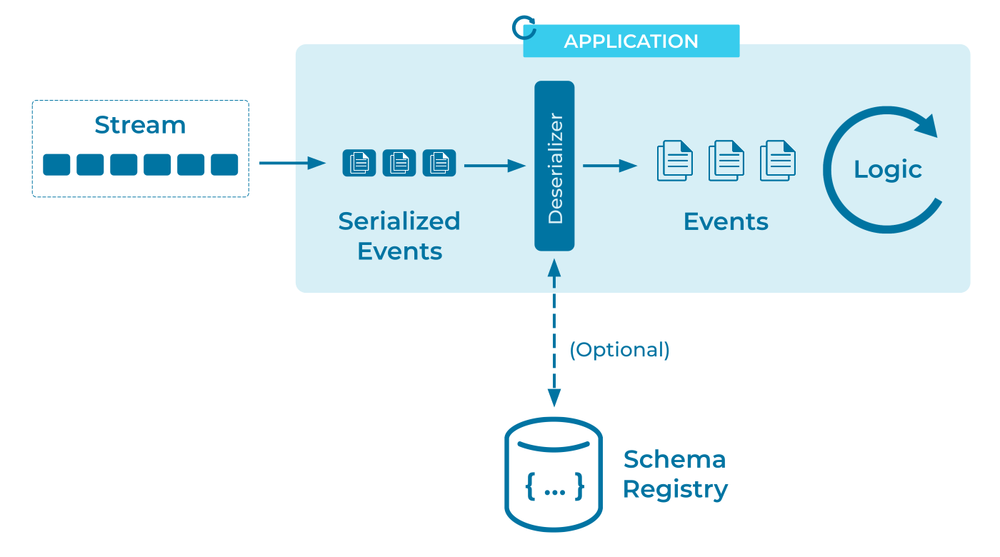

---
seo:
  title: Event Deserializer
  description: An Event Deserializer translates events that have been encoded for storage into usable, language-specific data structures.
---

# Event Deserializer

Data has a long lifecycle, often outliving the programs that
originally gathered and stored it. And data originates from a wide
variety of systems and programming languages. The more easily we can
access that ocean of data, the richer the analysis we can perform.

In an online shopping business, data recorded by the order-processing
system and from data user behavior may prove invaluable to the website
design department, _provided they can actually access it_. It's
vital to be able to read data from an [Event
Store](../event-storage/event-store.md) regardless of which process
and which department put it there originally.

To a large degree, the accessibility of data is determined at write
time, by our choice of [Event
Serializer](event-serializer.md). Still, the story is certainly not
complete until we've read the data back out.

## Problem

How can I reconstruct the original event from its representation in the event streaming platform?

## Solution



Use an [Event Streaming
Platform](../event-stream/event-streaming-platform.md) that integrates
well with a schema registry. This makes it easy to encourage (or
require) writers to record the event's data description for later
use. Having both the event data and its schema readily available makes
deserialization easy.

While some data formats are reasonably
[discoverable](https://en.wikipedia.org/wiki/Discoverability), in
practice it becomes invaluable to have a precise, permanent record of
how the data was encoded at the time it was written. This is
particularly true if the data format has evolved over time and the
[Event Stream](../event-stream/event-stream.md) may contain more than
one encoding of semantically-equivalent data.

## Implementation

Confluent’s [Schema
Registry](https://docs.confluent.io/cloud/current/cp-component/schema-reg-cloud-config.html)
stores a versioned history of the data's schema in Apache Kafka®
itself. The client libraries can then use this metadata to seamlessly
reconstruct the original event data, while we can use the registry API
to manually inspect the schemas, or to build libraries for other
languages.

For example, in the [Event Serializer](event-serializer.md) pattern
we wrote a table of `fx_trades` events. If we want to recall the
structure of those events we can ask for the Flink SQL table definition:

```sh
DESCRIBE fx_trades;
```

```text
+---------------+----------------+-------+-----+--------+-----------+
|          name |           type |  null | key | extras | watermark |
+---------------+----------------+-------+-----+--------+-----------+
|      trade_id |            INT | FALSE |     |        |           |
| from_currency |     VARCHAR(3) |  TRUE |     |        |           |
|   to_currency |     VARCHAR(3) |  TRUE |     |        |           |
|         price | DECIMAL(10, 5) |  TRUE |     |        |           |
+---------------+----------------+-------+-----+--------+-----------+
```

Or we can query the Schema Registry directly to see the structure in a
machine-readable format:

```sh
curl http://localhost:8081/subjects/fx_trades-value/versions/latest | jq .```

```json
{
  "subject": "fx_trades-value",
  "version": 1,
  "id": 1,
  "schema": "{\"type\":\"record\",\"name\":\"record\",\"namespace\":\"org.apache.flink.avro.generated\",\"fields\":[{\"name\":\"from_currency\",\"type\":[\"null\",\"string\"],\"default\":null},{\"name\":\"to_currency\",\"type\":[\"null\",\"string\"],\"default\":null},{\"name\":\"price\",\"type\":[\"null\",{\"type\":\"bytes\",\"logicalType\":\"decimal\",\"precision\":10,\"scale\":5}],\"default\":null}]}"
}
```

Unpacking that `schema` field reveals the [Avro][avro] specification:

```sh
curl http://localhost:8081/subjects/fx_trades-value/versions/latest | jq -rc .schema | jq .
```

```json
{
  "type": "record",
  "name": "record",
  "namespace": "org.apache.flink.avro.generated",
  "fields": [
    {
      "name": "from_currency",
      "type": [
        "null",
        "string"
      ],
      "default": null
    },
    {
      "name": "to_currency",
      "type": [
        "null",
        "string"
      ],
      "default": null
    },
    {
      "name": "price",
      "type": [
        "null",
        {
          "type": "bytes",
          "logicalType": "decimal",
          "precision": 10,
          "scale": 5
        }
      ],
      "default": null
    }
  ]
}
```

An Avro library can use this schema to deserialize the events
seamlessly. And any client libraries that are Schema Registry-aware
can automate this lookup, allowing us to forget about encodings
entirely and focus on the data.

## Considerations

In addition to Avro, Schema Registry supports Protobuf and JSON
Schema. See [Event Serializer](event-serializer.md) for a discussion
of these formats.

While the choice of serialization format is important, it doesn't have
to be set in stone. For example, it's straightforward to 
[translate between supported formats with Kafka Streams](https://developer.confluent.io/confluent-tutorials/serialization/kstreams/). 
For more complex scenarios, we have several strategies for managing schema migration:

* [Schema Compatibility](../event-stream/schema-evolution.md)
  discusses the kinds of "safe" schema changes that Avro is designed
  to handle transparently.
* [Event Translators](../event-processing/event-translator.md ) can
  convert between different encodings to aid consumption by different
  systems.
* [Schema Evolution](../event-stream/schema-evolution.md)
  discusses splitting and joining streams to simplify serving
  consumers that can only handle certain versions of the event's
  schema.
* An [Event Standardizer](event-standardizer.md) can reformat
  disparate data encodings into a single unified format.
* And we always have the option of handling encoding problems directly
  in code with a [Schema-on-Read](schema-on-read.md) strategy.

## References

* The counterpart of an event deserializer (for reading) is an [Event Serializer](event-serializer.md) (for writing).
* Serializers and deserializers are closely related to [Data
  Contracts](data-contract.md), in which we want to adhere to a
  specific serialization format, _and_ constrain the individual events
  to a certain schema within that format.
* See also: [Event Mapper](../event-processing/event-mapper.md).

[Avro]: https://avro.apache.org/docs/current/
