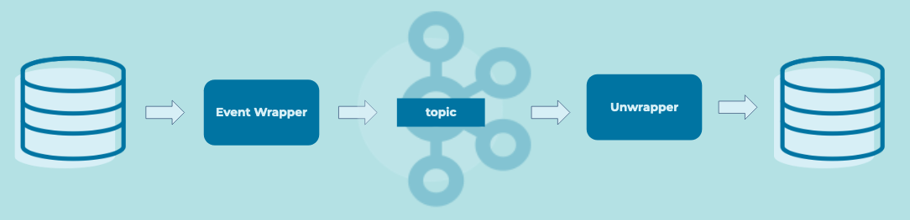

# Event Envelope

## Problem
How can existing systems operatie on the event streaming platform when there are specific requirements on the event format that the existing system does not support?

## Solution Pattern


## Example Implementation
```
static <T> Envelope<T> wrap(T payload, Iterable<Header> headers) {
	return new Envelope(serializer(payload), headers);
}
static <T> T unwrap(Envelope<T> envelope) {
	return envelope.payload;
}
```

## Considerations
TODO: optional section, not all patterns have/need this

## References
* [How to Choose Between Strict and Dynamic Schemas](https://www.confluent.io/blog/spring-kafka-protobuf-part-1-event-data-modeling/)
* [Event Source Connector](../event-source/event-source-connector.md)
* [Event Sink Connector](../event-sink/event-sink-connector.md)
