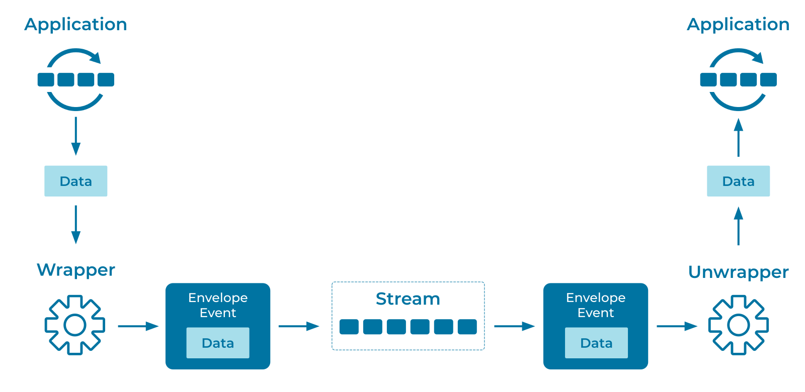

---
seo:
  title: Event Envelope
  description: The Event Envelope allows applications with different data formats to communicate across an Event Streaming Platform.
---

# Event Envelope
[Event Streaming Platforms](../event-stream/event-streaming-platform.md) allow many different types of applications to work together. An Event Envelope provides a standard set of well-known fields across all [Events](../event/event.md) sent through the [Event Streaming Applications](../event-processing/event-processing-application.md). The envelope is independent of the underlying event format, and often references attributes such as the encryption type, schema, key, and serialization format. Envelopes are analogous to protocol headers in networking (for example, TCP-IP).

## Problem
How can I convey information to all participants in an [Event Streaming Platform](../event-stream/event-streaming-platform.md) independently of the event payload? For example, how can I convey how to decrypt an [Event](../event/event.md), what schema is used, or what ID defines the uniqueness of the event?

## Solution


Use an Event Envelope to wrap the event data using a standard format agreed on by all participants of the [Event Streaming Platform](../event-stream/event-streaming-platform.md), or more broadly. [Cloud Events](https://cloudevents.io/) -- which standardize access to ID, Schema, Key, and other common event attributes -- are an industry-standard example of the Event Envelope pattern.

## Example Implementation
Using basic Java consumers and producers, you can use a helper function to wrap an application's immutable payload into an envelope which conforms to the expected format of the [Event Streaming Platform](../event-stream/event-streaming-platform.md):

```java
static <T> Envelope<T> wrap(T payload, Iterable<Header> headers) {
	return new Envelope(serializer(payload), headers);
}
static <T> T unwrap(Envelope<T> envelope) {
	return envelope.payload;
}
```

## References
* This pattern is derived from [Envelope Wrapper](https://www.enterpriseintegrationpatterns.com/patterns/messaging/EnvelopeWrapper.html) in _Enterprise Integration Patterns_, by Gregor Hohpe and Bobby Woolf.
* [How to Choose Between Strict and Dynamic Schemas](https://www.confluent.io/blog/spring-kafka-protobuf-part-1-event-data-modeling/)
* See [CloudEvents](https://cloudevents.io/) for a specification that describes event header information in a common way.
