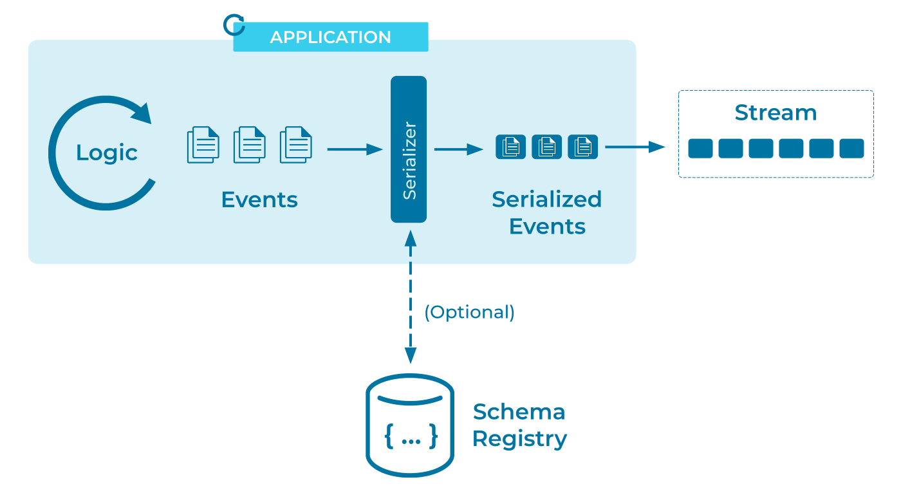

---
seo:
  title: Event Serializer
  description: An Event Serializer encodes events so that the can be written to disk, transferred across the network, and generally preserved for future readers.
---

# Event Serializer

Data has a long lifecycle, often outliving the programs that
originally gathered and stored it. And data demands a broad
audience - the more accessible our data is, the more departments in
our organization can find use for it. 

In a successful system, data gathered by the sales department in one
year may prove invaluable to the marketing department a few years
later, _provided they can actually access it_.

For maximum utility and longevity, data should be written in a way
that doesn't obscure it from future readers and writers. The data is
more important than today's technology choices.

How is this affect an event-based system? Are there any special
concerns for this kind of architecture, or will the programming
language's serialization tools suffice?

## Problem

How can I convert an event into a format understood by the event streaming platform?

## Solution



[Event Streaming
Platforms](../event-stream/event-streaming-platform.md) such as Apache
Kafka&reg; are typically serialization-agnostic, accepting any
serialized data from human-readable text to raw bytes. However, by
constraining ourselves to more widely-accepted, structured data
formats, we can open the door to easier collaboration with other
projects and programming languages.

Finding a "universal" serialization format isn't a new problem, or
one unique to event streaming. As such we have a number of
technology-agnostic solutions readily available. To briefly cover a
few:

* [JSON](https://www.json.org/). Arguably the most successful
  serialization format in the history of computing. JSON is a
  text-based format that's easy to read, write and
  decipher<sup>1</sup>, as evidenced by the number of languages and
  projects that produce and consume JSON data across the world with
  minimal collaboration.
* [Protocol
  buffers](https://developers.google.com/protocol-buffers). Backed by
  Google and supported by a wide variety of languages, Protobuf is a
  binary format that sacrifices the discoverability of JSON for a much
  more compact representation that uses less disk space and network
  bandwidth. Protobuf is also a strongly-typed format, allowing
  enforcement of a particular data schema from writers, and describing
  the structure of that data to readers.
* [Avro](https://avro.apache.org/). A binary format similar to
  Protocol Buffers, Avro's design has focuses on supporting the
  evolution of schemas, allowing the data format to change over time
  while minimizing the impact to future readers and writer.

## Implementation

For example we can use Avro to define a structure for Foreign Exchange
trade deals as:

```json
{"namespace": "io.confluent.developer",
 "type": "record",
 "name": "FxTrade",
 "fields": [
     {"name": "trade_id", "type": "long"},
     {"name": "from_currency", "type": "string"},
     {"name": "to_currency", "type": "string"},
     {"name": "price", "type": "long"}
 ]
}
```

...and then use our language's Avro libraries to serialize data in
this format. Alternatively we can define an [Event
Stream](../event-stream/event-stream.md) directly in ksqlDB in a way
that enforces that format and records the Avro definition with a [Schema Validator](../event-source/schema-validator.md):

```sql
CREATE OR REPLACE STREAM fx_trade (
  trade_id BIGINT KEY,
  from_currency VARCHAR(3),
  to_currency VARCHAR(3),
  price DECIMAL(10,5)
) WITH (
  KAFKA_TOPIC = 'fx_trade',
  KEY_FORMAT = 'avro',
  VALUE_FORMAT = 'avro',
  PARTITIONS = 3
);
```


## Considerations

While the choice of serialization format is important, it doesn't have
to be set in stone. Using an [Event
Translator](../event-processing/event-translator.md ) or [Event
Standardizer](./event-standardizer.md) we can revisit this decision if
it becomes necessary.

## References

* The counterpart of an event serializer (for writing) is an [Event Deserializer](./event-deserializer.md) (for reading).
* Serializers and deserializers are closely related to [Data
  Contracts](./data-contract.d), in which we want to adhere to a
  specific serialization format, _and_ constrain the individual events
  to a certain schema within that format.
* See also: [Event Mapper](../event-processing/event-mapper.md).

## Footnotes

_<sup>1</sup> Older programmers will tell tales of the
less-discoverable serialization formats used by banks in the 80s, in
which deciphering the meaning of a message meant wading through a
thick, ring-bound printout of the data specification which explained the
meaning of "Field 78" by cross-referencing "Encoding Subformat 22"._
