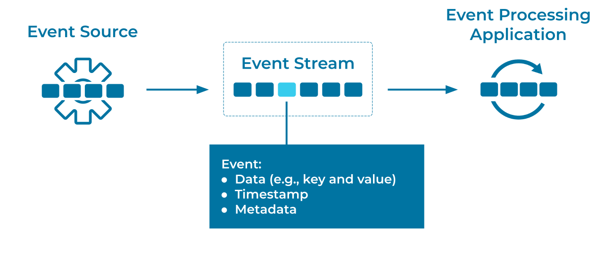

---
seo:
  title: Event
  description: Events represent facts and are used by decoupled applications, services, and systems to exchange data across an Event Streaming Platform.
---

# Event
Events represent facts and are used by decoupled applications, services, and systems to exchange data across an [Event Streaming Platform](../event-stream/event-streaming-platform.md).

## Problem
How do I represent a fact about something that has happened?

## Solution

An event represents an immutable fact about something that happened. Examples of Events might be orders, payments, activities, or measurements. Events are produced to, stored in, and consumed from an [Event Stream](../event-stream/event-stream.md). An Event typically contains one or more data fields that describe the fact, as well as a timestamp that denotes when the Event was created by its [Event Source](../event-source/event-source.md). The Event may also contain various metadata, such as its source of origin (for example, the application or cloud service that created the event) and storage-level information (for example, its position in the event stream).

## Implementation
In Apache Kafka®, Events are referred to as _records_. Records are modeled as a key / value pair with a timestamp and optional metadata (called headers). The _value_ of the record usually contains the representation of an application domain object or some form of raw message value, such as the output of a sensor or other metric reading. The record _key_ is useful for a few reasons, but critically, it is used by Kafka to determine how the data is partitioned within a stream, also called a _topic_ (for more details on partitioning, see [Partitioned Parallelism](../event-stream/partitioned-parallelism.md)). The _key_ is often best thought of as a categorization of the Event, like the identity of a particular user or connected device. Headers are a place for record metadata that can help to describe the Event data itself, and are themselves modeled as a _map_ of keys and values.

Record keys, values, and headers are opaque data types, meaning that Kafka, by deliberate design to achieve its high scalability and performance, does not define a type interface for them: they are read, stored, and written by Kafka's server-side brokers as raw arrays of bytes. It is the responsibility of Kafka _client_ applications, such as the streaming database [ksqlDB](https://ksqldb.io/), or microservices implemented with the client libraries, such as [Kafka Streams](https://docs.confluent.io/platform/current/streams/index.html) or the [Kafka Go client](https://docs.confluent.io/clients-confluent-kafka-go/current/overview.html), to perform serialization and deserialization of the data within the record keys, values, and headers.

When using the Java client library, events are created using the `ProducerRecord` type and are sent to Kafka using the `KafkaProducer`. In this example, we have set the key and value types as strings, and we have added a header:

```java
ProducerRecord<String, String> producerRecord = new ProducerRecord<>(
  paymentEvent.getCustomerId().toString() /* key */, 
  paymentEvent.toString() /* value */);

producerRecord.headers()
  .add("origin-cloud", "aws".getBytes(StandardCharsets.UTF_8)); 

producer.send(producerRecord);
```

## Considerations
* To ensure that Events from an Event Source can be read correctly by an [Event Processor](../event-processing/event-processor.md), they are often created in reference to an Event schema. Event schemas are commonly defined in [Apache Avro](https://avro.apache.org/docs/current/spec.html), [Protocol Buffers](https://developers.google.com/protocol-buffers) (Protobuf), or [JSON Schema](https://json-schema.org/).

* For cloud-based architectures, evaluate the use of [CloudEvents](https://cloudevents.io/). CloudEvents provide a standardized [Event Envelope](../event/event-envelope.md) that wraps an event, making common event properties such as source, type, time, and ID universally accessible, regardless of how the event itself was serialized.

* In certain scenarios, Events may represent commands (instructions, actions, and so on) that should be carried out by an Event Processor reading the events. See the [Command Event](../event/command-event.md) pattern for details.

## References
* This pattern is derived in part from [Message](https://www.enterpriseintegrationpatterns.com/patterns/messaging/Message.html), [Event Message](https://www.enterpriseintegrationpatterns.com/patterns/messaging/EventMessage.html), and [Document Message](https://www.enterpriseintegrationpatterns.com/patterns/messaging/DocumentMessage.html) in _Enterprise Integration Patterns_, by Gregor Hohpe and Bobby Woolf.
* [Apache Kafka 101: Introduction](/learn-kafka/apache-kafka/events/) provides a primer on "What is Kafka, and how does it work?" including information on core concepts like Events
