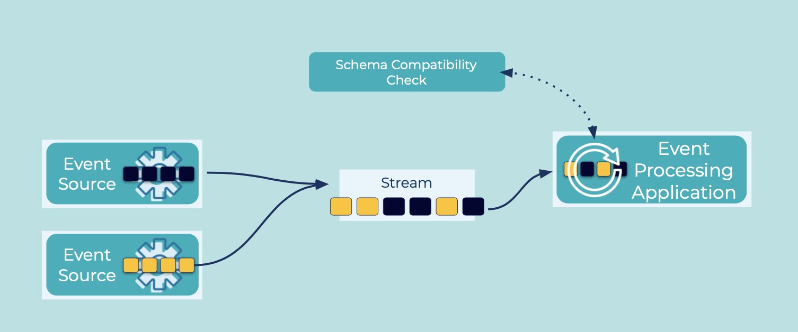

---
seo:
  title: Schema-on-Read
  description: Schema on Read enables the reader of data to determine which schema to apply to the data that is processed.
---

# Schema-on-Read
Schema on Read enables the reader of data to determine which schema to apply to the data that is processed.

There are several use cases:

1. When the sequencing matters between events of different types and all those different event types are put into a single stream.  For example, consider a banking use case where first a customer opens an account, then gets approval, then makes a deposit, etc. Here, the sequencing really matters.  Put these heterogeneous [Event](../events/event.md) types into the same stream, allowing the [Event Streaming Platform](../event-stream/event-streaming-platform.md) maintain ordering and the consumer application deserialize the events.

2. When there are different versions of the same schema, and the reader chooses which version to apply to a given event.

3. When unstructured data is written into an [Event Stream](../event-stream/event-stream.md), and the reader then applies whatever schema it wants.

## Problem
How can an [Event Processor](../event-processing/event-processor.md) apply a schema on the data it is reading from an [Event Streaming Platform](../event-stream/event-streaming-platform.md)?

## Solution


## Implementation
Each Kafka client applications can decide on how read data, and which version of which schema to apply to every [Event](../events/event.md) that it reads.
Confluent Schema Registry makes schema management easy, with a centralized schema repository that can store multiple versions of different schemas.

In addition to just storing the schema information, Schema Registry also checks that schema changes are compatible with previous versions.
In order to have different event types in the same Kafka topic, set the "subject naming strategy" to register schemas against the record type, instead of the Kafka topic.
Schema Registry will then let schema evolution and compatibility checking to happen within the scope of each event type instead of the topic.

The consumer application can read schema versions assigned to the data type, and in the case where there are different data types in any given stream, the application can cast each event to the appropriate type at processing time and follow the appropriate code path:

```java
if (Account.equals(record.getClass()) {
  ...
} else if (Approval.equals(record.getClass())) {
  ...
} else if (Transaction.equals(record.getClass())) {
  ...
} else {
  ...
}
```

## Considerations
The schema's subject naming strategy can be set to record type (instead of Kafka topic) in one of two ways.
The less restrictive is `RecordNameStrategy`, which sets the namespace to the record, regardless of which topic the event is written to.
The more restrictive is `TopicRecordNameStrategy`, which sets the namespace to both, the record and the topic the event is  written to.

## References
* [Blog Should You Put Several Event Types in the Same Kafka Topic?"](https://www.confluent.io/blog/put-several-event-types-kafka-topic/)
* [Confluent Schema Registry](https://docs.confluent.io/cloud/current/cp-component/schema-reg-cloud-config.html)
