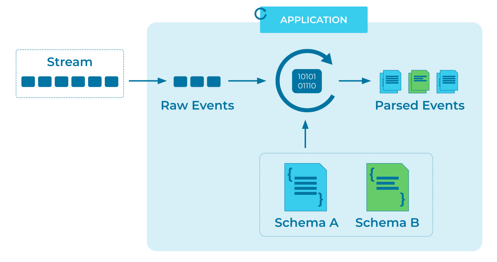

---
seo:
  title: Schema-on-Read
  description: Schema on Read enables a reader of data to determine which schema to apply to processed data.
---

# Schema-on-Read
Schema-on-Read leaves the validation of an [Event](../event/event.md) schema to the reader.
There are several use cases for this pattern, and all of them provide a lot of flexibility to [Event Processors](../event-processing/event-processor.md) and [Event Sinks](../event-sink/event-sink.md):

1. There may be different versions of the same schema type, and the reader wants to choose which version to apply to a given event.

2. The sequencing may matter between events of different types, while all of the different event types are put into a single stream.  For example, consider a banking use case where a customer first opens an account, then gets approval, then makes a deposit, and so on. Put these heterogeneous [Event](../event/event.md) types into the same stream, allowing the [Event Streaming Platform](../event-stream/event-streaming-platform.md) to maintain event ordering and allowing any consuming [Event Processors](../event-processing/event-processor.md) and [Event Sinks](../event-sink/event-sink.md) to [deserialize](../event/event-deserializer.md) the events as needed.

3. There may be unstructured data written into an [Event Stream](../event-stream/event-stream.md), and the reader can then apply whichever schema it wants.

## Problem
How can an [Event Processor](../event-processing/event-processor.md) apply a schema to data while reading the data from an [Event Streaming Platform](../event-stream/event-streaming-platform.md)?

## Solution


The Schema-on-Read approach enables each reader to decide how to read data, and which version of which schema to apply to each [Event](../event/event.md) that it reads.
To make schema management easier, the design can use a centralized repository that stores multiple versions of different schemas, and then client applications can choose which schema to apply to events at runtime.

## Implementation
With [Confluent Schema Registry](https://docs.confluent.io/cloud/current/cp-component/schema-reg-cloud-config.html), all of the schemas are managed in a centralized repository.
In addition to storing the schema information, Schema Registry can be configured to check and enforce that schema changes are compatible with previous versions.

For example, if a business started with a schema definition for an event that has two fields, but the business needs later evolve to warrant an optional third field, then the schema evolves with the needs of the business.
Schema Registry ensures that the new schema is compatible with the old schema.
In this particular case, for backward compatibility, the third field, `status`, can be defined with a default value, which will be used for the missing field when deserializing data encoded with the old schema.
This ensures that all events in a given stream follow [Schema Compatibility](../event-stream/schema-compatibility.md) rules and that applications can continue to process those events.

```
{
 "namespace": "example.avro",
 "type": "record",
 "name": "user",
 "fields": [
     {"name": "name", "type": "string"},
     {"name": "address",  "type": "string"},
     {"name": "status", "type": "string", "default": "waiting"}
 ]
}
```

As another example, if a use case warrants different event types being written into a single stream, with Apache Kafka&reg; you can set the "subject naming strategy" to register schemas against the record type instead of the Kafka topic.
Schema Registry will then allow for [Schema Evolution](../event-stream/schema-evolution.md) and [Schema Compatibility](../event-stream/schema-compatibility.md) validation to be performed within the scope of each event type rather than the topic.

The consumer application can read schema versions assigned to the data type, and if there are different data types in any given stream, the application can cast each event to the appropriate type at processing time and then follow the appropriate code path:

```java
if (Account.equals(record.getClass()) {
  ...
} else if (Approval.equals(record.getClass())) {
  ...
} else if (Transaction.equals(record.getClass())) {
  ...
} else {
  ...
}
```

## Considerations
The schema's subject naming strategy can be set to record type (rather than Kafka topic) in one of two ways.
The less restrictive is `RecordNameStrategy`, which sets the namespace to the record, regardless of the topic to which the event is written.
The more restrictive is `TopicRecordNameStrategy`, which sets the namespace to both the record and the topic to which the event is written.

## References
* [Should You Put Several Event Types in the Same Kafka Topic?](https://www.confluent.io/blog/put-several-event-types-kafka-topic/)
* [Confluent Schema Registry documentation](https://docs.confluent.io/cloud/current/cp-component/schema-reg-cloud-config.html)
