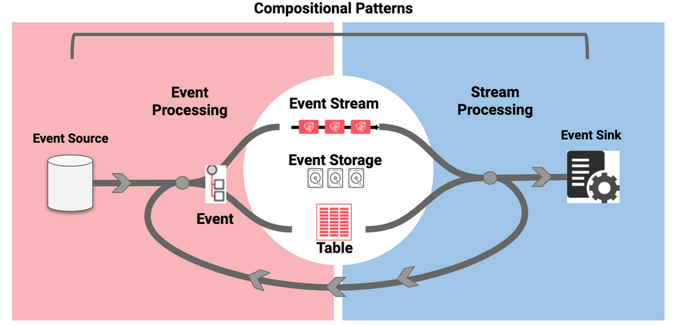

# Welcome to Event Streaming Patterns

Event Streaming Platforms provide an architecture that enables software to react and operate as events occur. These platforms allow for software components to work together in a real-time, decoupled, and scalable fashion. When software is modeled as streams of events, new capabilities surface along with new unique technical challenges.

This catalog contains simple and reusable architectural patterns that can be applied over event streaming systems. When composed together, these patterns can help meet the design demands of modern real-time distributed systems. The following patterns are categorized by their function in the event streaming system, including sourcing data, processing events as streams, to integrations with external systems.

TODO: Brand main image
