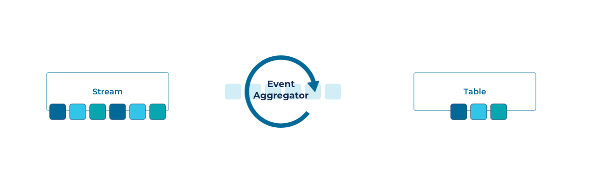
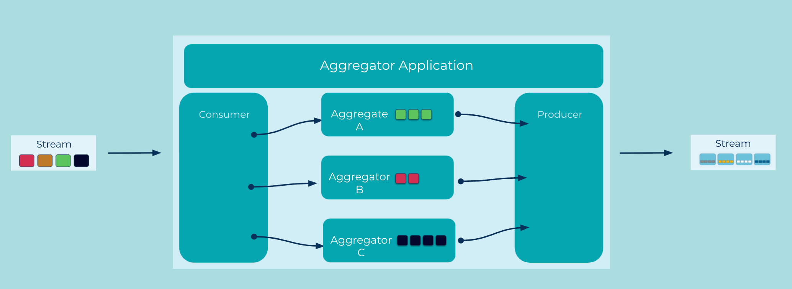

---
seo:
  title: Event Aggregator
  description: Aggregate multiple related events, or the values from those events, into a single new event.
---
# Event Aggregator

Combing multiple events into a single encompassing event—e.g., to compute totals or averages, or to re-aggregate events split by an [Event Splitter](../event-processing/event-splitter.md)—is a common task in event streaming and streaming analytics.

## Problem

How can multiple individual, but related events be combined to produce a new event?

## Solution A

If we need to produce a single event containing an aggregation of values in simliar events within a window of time, we can use a windowed aggregator to collect the values from those events and emit a single event at the close of the window.

## Example Implementation A


We can use ksqlDB and Apache Kafka® to perform this aggregation.

We'll start by creating a stream based on an existing Kafka topic:
```sql
  CREATE STREAM orders (orderid INT, itemid INT, total_units DOUBLE)
  WITH (KAFKA_TOPIC='orders', VALUE_FORMAT='AVRO');
```

Then we'll create a table containing the aggregated events from that stream:
```sql
  CREATE TABLE item_stats AS 
  SELECT itemid, COUNT(*) AS total_orders, AVG(orderunits) AS avg_units
  FROM agg_orders WINDOW TUMBLING (SIZE 1 HOUR)
  GROUP BY itemid 
  EMIT CHANGES;  
```

## Solution B

Sometimes we may need to aggregate whole events, either within a time window, or based on a completion condition, into a set that will be bundled into a new event. We can do this with an aggregator that will collect and hold the events until the completion condition or timeout occurs.

## Example Implementation


In this example, we'll build an aggregator in which we will use a value in the event, perhaps a [Correlation Identifer](../docs/event/correlation-identifier.md) to find related events and add them to an aggregate if one exists.  If no aggregate exists, we create one and add the event. Then we check a completion condition and if true, we will produce a new event with that aggregate. The completion condition will vary by use case, but in our example it will be an expected total included in each event.

```java
final Map<String ProcessedOrder> orders = new HashMap<>();

while (keepConsuming) {
  try {
    final ConsumerRecords<String, ProcessedItem> records = consumer.poll(Duration.ofSeconds(1));
    records.forEach(record -> {
      ProcessedOrder order = orders.get(record.key());
      if(order == null){
        order = new ProcessedOrder();
        orders.put(record.key(), order);
      }
      order.addItem(record.value());
      if (record.value().getTotal().equals(order.itemCount())){
        produceProcessedOrderEvent(order);
      }
    }
  }
  catch (Exception ex) {
    ...
  }
}
```

## Considerations
In event streaming, a key technical challenge is that it is generally not possible to tell whether input is "complete" at a given point in time. For this reason, stream processing technologies such as ksqlDB and Kafka Streams employ techniques such as grace periods (see [`GRACE PERIOD`](https://docs.ksqldb.io/en/latest/concepts/time-and-windows-in-ksqldb-queries/) clause in ksqlDB) to define cutoff points after which an [Event Processor](TODO: add link) will discard any late-arriving input events from its processing.

## References
This pattern was derived from [Aggregator](https://www.enterpriseintegrationpatterns.com/patterns/messaging/Aggregator.html) pattern in Enterprise Integration Patterns by Gregor Hohpe and Bobby Woolf
