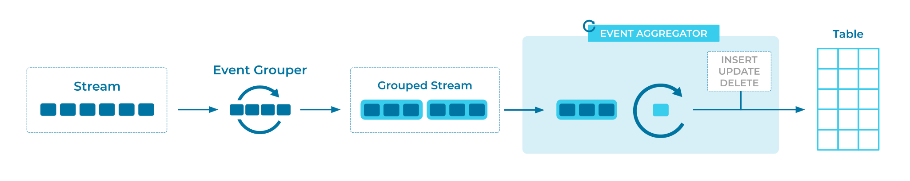

---
seo:
  title: Event Aggregator
  description: Perform an aggregation across multiple related events to produce a new event.
---
# Event Aggregator

Combining multiple events into a single encompassing event—e.g., to compute totals, averages, etc.—is a common task in event streaming and streaming analytics.


## Problem

How can multiple related events be aggregated to produce a new event?

## Solution

We use an [Event Grouper](../stream-processing/event-grouper.md) followed by an event aggregator. The grouper prepares the input events as needed for the subsequent aggregation step, e.g. by grouping the events based on the data field by which the aggregation is computed (such as a customer ID) and/or by grouping the events into time windows (such as 5-minute windows). The aggregator then computes the desired aggregation for each group of events, e.g., by computing the average or sum of each 5-minute window.


## Implementation


For example, we can use [Apache Flink® SQL](https://nightlies.apache.org/flink/flink-docs-stable/docs/dev/table/sql/gettingstarted/) and Apache Kafka® to perform an aggregation.

Assuming that we have a Flink SQL table called `orders` based on an existing Kafka topic:

```sql
CREATE TABLE orders (
    order_id INT,
    item_id INT,
    total_units INT,
    ts TIMESTAMP(3),
    WATERMARK FOR ts AS ts
);
```

Then we'll create a derived table containing the aggregated events from that stream. In this case, we create a table called `item_stats` that represents per-item order statistics over 1-hour windows:

```sql
CREATE TABLE item_stats AS
  SELECT item_id,
      COUNT(*) AS total_orders,
      AVG(total_units) AS avg_units,
      window_start,
      window_end
  FROM TABLE(TUMBLE(TABLE orders, DESCRIPTOR(ts), INTERVAL '1' HOURS))
  GROUP BY item_id, window_start, window_end;
```

This table will be continuously updated whenever new events arrive in the `orders` table.


## Considerations

* In event streaming, a key technical challenge is that—with few exceptions—it is generally not possible to tell whether the input data is "complete" at a given point in time. For this reason, stream processing technologies such as the Kafka Streams client library of Apache Kafka employ techniques such as _slack time_<sup>1</sup> and _grace periods_ (e.g., see the Kafka Streams [`ofSizeAndGrace`](https://kafka.apache.org/38/javadoc/org/apache/kafka/streams/kstream/TimeWindows.html#ofSizeAndGrace(java.time.Duration,java.time.Duration)) method for specifying a grace period in windowing operations). Apache Flink® watermarks and associated watermark strategies define cutoff points after which an [Event Processor](../event-processing/event-processor.md) will discard any late-arriving input events from its processing, e.g, see the delayed watermark strategy Flink SQL examples [here](https://nightlies.apache.org/flink/flink-docs-stable/docs/dev/table/concepts/time_attributes/). See the [Suppressed Event Aggregator](../stream-processing/suppressed-event-aggregator.md) pattern for additional information.


## References

* Related patterns: [Suppressed Event Aggregator](../stream-processing/suppressed-event-aggregator.md)
* More detailed examples of event aggregation can be seen in the following tutorials:
  [How to count a stream of events with Kafka Streams](https://developer.confluent.io/confluent-tutorials/aggregating-count/kstreams/) and [How to count a stream of events with Flink SQL](https://developer.confluent.io/confluent-tutorials/aggregating-count/flinksql/).


## Footnotes

<sup>1</sup>Slack time: [Beyond Analytics: The Evolution of Stream Processing Systems (SIGMOD 2020)](https://dl.acm.org/doi/abs/10.1145/3318464.3383131), [Aurora: a new model and architecture for data stream management (VLDB Journal 2003)](https://dl.acm.org/doi/10.1007/s00778-003-0095-z)
