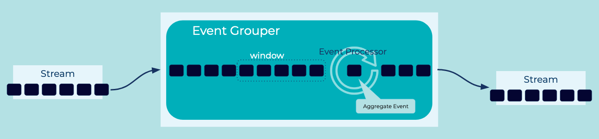

---
seo:
  title: Event Grouper
  description: Event Grouper is an Event Processor that groups events together by a common attribute in the Event using an Aggregate function.
---

# Event Grouper
An event grouper is a specialized form of an [Event Processor](../event-processing/event-processor.md) that groups events together by a common field, such as a customer ID, and/or by event timestamps (often called _windowing_ or _time-based windowing_).

## Problem

How can individual, but related events from the same [Event Stream](../event-stream/event-stream.md) or [Table](../table/state-table.md) be grouped, so that they can subsequently be processed as a whole?


## Solution


For _time-based grouping_ a.k.a. _time-based windowing_, we use a `WINDOW` [Event Processor](../event-processing/event-processor.md) to group the related events into windows based on their event timestamps. Most window types have a pre-defined window size, such as 10 minutes or 24 hours. An exception is session windows, where the size of each window varies depending on the time characteristics of the grouped events.

For _field-based_ grouping, we use a `GROUP BY` Event Processor that groups events by one or more data fields, irrespective of the event timestamps.

The two grouping approaches are orthogonal and can be composed. For example, to compute 7-day averages for every customer in a stream of payments, we first group the events in the stream by customer ID _and_ by 7-day windows, and then compute the respective averages for each customer+window grouping.

## Implementation
[ksqlDB](https://ksqldb.io/) provides the capability to group related events by a column and group them into ["windows"](https://docs.ksqldb.io/en/latest/concepts/time-and-windows-in-ksqldb-queries/) where all the related events have a timestamp within the defined time-window.

```
SELECT product-name, COUNT(*), SUM(price) FROM purchases
  WINDOW TUMBLING (SIZE 1 MINUTE)
  GROUP BY product-name EMIT CHANGES;
```

## Considerations


## References
* See the full tutorials on using [Session Windows](https://kafka-tutorials.confluent.io/create-session-windows/ksql.html) and [Hopping Windows](https://kafka-tutorials.confluent.io/create-hopping-windows/ksql.html) with [ksqlDB](https://ksqldb.io/).
* The [Tumbling Windows](https://kafka-tutorials.confluent.io/create-tumbling-windows/ksql.html) tutorial provides an end-to-end example for calculating an aggregate calculation over a window of [Events](../event/event.md).
