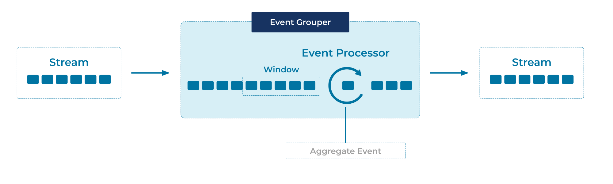

---
seo:
  title: Event Grouper
  description: Event Grouper is an Event Processor that groups events together by a common attribute in the Event using an Aggregate function.
---

# Event Grouper
An event grouper is a specialized form of an [Event Processor](../event-processing/event-processor.md) that groups events together by a common field, such as a customer ID, and/or by event timestamps (often called _windowing_ or _time-based windowing_).

## Problem

How can we group individual but related events from the same [Event Stream](../event-stream/event-stream.md) or [Table](../table/state-table.md), so that they can subsequently be processed as a whole?


## Solution


For _time-based grouping_ a.k.a. _time-based windowing_, we use an [Event Processor](../event-processing/event-processor.md) that groups the related events into windows based on their event timestamps. Most window types have a pre-defined window size, such as 10 minutes or 24 hours. An exception is session windows, where the size of each window varies depending on the time characteristics of the grouped events.

For _field-based_ grouping, we use an Event Processor that groups events by one or more data fields, irrespective of the event timestamps.

The two grouping approaches are orthogonal and can be composed. For example, to compute 7-day averages for every customer in a stream of payments, we first group the events in the stream by customer ID _and_ by 7-day windows, and then compute the respective averages for each customer+window grouping.

## Implementation
As an example, [Apache Flink® SQL](https://nightlies.apache.org/flink/flink-docs-stable/docs/dev/table/sql/gettingstarted/) provides the capability to group related events by a column and group them into windows where all the related events have a timestamp within the defined time-window.

```
SELECT product_name, SUM(price) as total
FROM TABLE(TUMBLE(TABLE purchases, DESCRIPTOR(ts), INTERVAL '1' MINUTES))
GROUP BY product_name, window_start, window_end;
```

## Considerations
When grouping events into time windows, there are various types of groupings possible. 

* Hopping Windows are based on time intervals. They model fixed-sized, possibly overlapping windows. A hopping window is defined by two properties: the window's duration and its advance or "hop", interval.
* Tumbling Windows are a special case of hopping windows. Like hopping windows, tumbling windows are based on time intervals. They model fixed-size, non-overlapping, gap-less windows. A tumbling window is defined by a single property: the window's duration.
* Session Windows aggregate events into a session, which represents a period of activity separated by a specified gap of inactivity, or "idleness". Any records with timestamps that occur within the inactivity gap of existing sessions are merged into the existing session. If a record's timestamp occurs outside of the session gap, a new session is created.

See the [Flink SQL windowing table-valued functions](https://nightlies.apache.org/flink/flink-docs-stable/docs/dev/table/sql/queries/window-tvf/) and the [Kafka Streams supported window types](https://docs.confluent.io/platform/current/streams/developer-guide/dsl-api.html#streams-developer-guide-dsl-windowing) for details and diagrams explaining window types.

## References
* The [Tumbling Windows in Apache Flink® SQL](https://developer.confluent.io/confluent-tutorials/tumbling-windows/flinksql/) and the [Tumbling Windows in Kafka Streams](https://developer.confluent.io/confluent-tutorials/tumbling-windows/kstreams/) tutorials provide an end-to-end example for calculating an aggregate calculation over a window of events.
* Related full tutorials are [Session Windows in Flink SQL](https://developer.confluent.io/confluent-tutorials/session-windows/flinksql/) and [Session Windows in Kafka Streams](https://developer.confluent.io/confluent-tutorials/session-windows/kstreams/), as well as [Hopping Windows in Flink SQL](https://developer.confluent.io/confluent-tutorials/hopping-windows/flinksql/).
