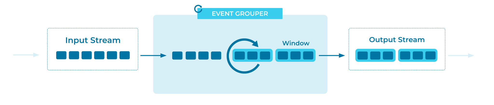

---
seo:
  title: Event Grouper
  description: An Event Grouper is an Event Processor that uses an Aggregate function to group Events together by a common Event attribute.
---

# Event Grouper
An Event Grouper is a specialized form of an [Event Processor](../event-processing/event-processor.md) that groups Events together by a common field, such as a customer ID, and/or by Event timestamps (this is often called _windowing_, or _time-based windowing_).

## Problem

How can we group individual but related Events from the same [Event Stream](../event-stream/event-stream.md) or [Table](../table/state-table.md), so that they can subsequently be processed as a whole?

## Solution


For _time-based grouping_ (also known as _time-based windowing_), we use an [Event Processor](../event-processing/event-processor.md) that groups the related Events into windows based on their Event timestamps. Most window types have a pre-defined window size, such as 10 minutes or 24 hours. An exception is the case of session windows, where the size of each window varies depending on the time characteristics of the grouped Events.

For _field-based_ grouping, we use an Event Processor that groups Events by one or more data fields, irrespective of the Event timestamps.

These two grouping approaches are orthogonal and can be composed. For example, to compute seven-day averages for every customer in an Event Stream containing payment Events, we would first group the Events by customer ID _and_ by seven-day windows, and then compute the respective averages for each customer/window grouping.

## Implementation
As an example, the streaming database [ksqlDB](https://ksqldb.io/) provides the capability to group related Events by a column and then group them into ["windows"](https://docs.ksqldb.io/en/latest/concepts/time-and-windows-in-ksqldb-queries/), where each of the related Events has a timestamp within the defined time window:

```
SELECT product-name, COUNT(*), SUM(price) FROM purchases
  WINDOW TUMBLING (SIZE 1 MINUTE)
  GROUP BY product-name EMIT CHANGES;
```

## Considerations
There are multiple types of time window grouping:

* Hopping Windows are based on time intervals. They model fixed-sized, possibly overlapping windows. A hopping window is defined by two properties: the window's duration, and its advance (or "hop") interval.
* Tumbling Windows are a special case of hopping windows. Similar to hopping windows, tumbling windows are based on time intervals. They model fixed-size, non-overlapping, gap-less windows. A tumbling window is defined by a single property: the window's duration.
* Session Windows aggregate Events into a session, which represents a period of activity separated by a specified gap of inactivity (or "idleness"). Any Events with timestamps that occur within the inactivity gap of existing sessions are merged into the existing session. If an Event's timestamp occurs outside of the session gap, a new session is created.

For details and diagrams explaining window types, see the documentation regarding [ksqlDB supported window types](https://docs.ksqldb.io/en/latest/concepts/time-and-windows-in-ksqldb-queries/#window-types) and [Kafka Streams supported window types](https://docs.confluent.io/platform/current/streams/developer-guide/dsl-api.html#streams-developer-guide-dsl-windowing).

## References
* The tutorial "How to create tumbling windows" ([ksqlDB version](https://kafka-tutorials.confluent.io/create-tumbling-windows/ksql.html), [Kafka Streams version](https://kafka-tutorials.confluent.io/create-tumbling-windows/kstreams.html)) provides an end-to-end example of performing an aggregate calculation over a window of Events.
* See also the full tutorials "Create session windows" ([ksqlDB version](https://kafka-tutorials.confluent.io/create-session-windows/ksql.html), [Kafka Streams version](https://kafka-tutorials.confluent.io/create-session-windows/kstreams.html)) and "How to create hopping windows" ([ksqlDB version](https://kafka-tutorials.confluent.io/create-hopping-windows/ksql.html)).
