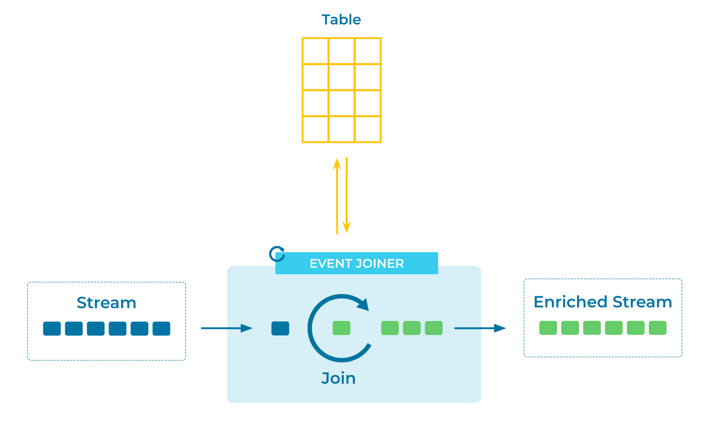

---
seo:
  title: Event Joiner
  description: A stream of events can be enhanced with lookup data by joining the stream with a table or another stream
---

# Event Joiner

[Event Streams](../event-stream/event-stream.md) may need to be joined (i.e., enriched) with a [Table](../table/state-table.md) or another stream to provide more comprehensive details about their respective [Events](../event/event.md).

## Problem

How can I enrich an event stream or table with additional context?

## Solution



We can combine events in a stream with another stream or table by performing a join between the two.  The join is based on a key the stream and the "other" stream or table have in common.  Also we can provide a window buffering mechanism based on timestamps so we can produce join results when events from both streams aren't immediately available.  Another approach is to join a stream and a table where the table contains more static data resulting in an enriched event stream. 


## Implementation

With ksqlDB we can create a stream of events from an existing Kafka topic (note this example's similarity to [fact tables](https://en.wikipedia.org/wiki/Fact_table) in data warehouses):

```sql
CREATE STREAM ratings (MOVIE_ID INT KEY, rating DOUBLE)
    WITH (KAFKA_TOPIC='ratings');
```

Then create a table from on another existing Kafka topic that changes less frequently. This table serves as our reference data (cf. [dimension tables](https://en.wikipedia.org/wiki/Dimension_(data_warehouse)) in data warehouses).

```sql
CREATE TABLE movies (ID INT PRIMARY KEY, title VARCHAR, release_year INT)
    WITH (KAFKA_TOPIC='movies');

```

To create a stream of enriched events, we perform a join between the stream and the table.

```sql
SELECT ratings.movie_id AS ID, title, release_year, rating
   FROM ratings
   LEFT JOIN movies ON ratings.movie_id = movies.id
   EMIT CHANGES;
```

## Considerations

* In ksqlDB, joins between a stream and a table are driven by the stream side of the join.  Updates to the table only update the state of the table.  It's the new event in the stream that results in a new join result.  For example, if we're joining a stream of orders to a table of customers a new order will be enriched if there is a customer record in the table. But if a new customer is added to the table it will not trigger the join condition. The [ksqlDB documentation contains more information on stream-table join semantics](https://docs.ksqldb.io/en/latest/developer-guide/joins/join-streams-and-tables/#semantics-of-stream-table-joins). 

* We can perform an inner or left-outer join between a stream and a table.

* Joins are also useful to initiate subsequent processing when two (or more) corresponding events arrive on different streams or tables.


## References

* [Tutorial: How to join a stream and a lookup table in ksqlDB](https://kafka-tutorials.confluent.io/join-a-stream-to-a-table/ksql.html)
* [Tutorial: Joining a stream and a stream in ksqlDB](https://kafka-tutorials.confluent.io/join-a-stream-to-a-stream/ksql.html)
* [Tutorial: How to join a table and a table in ksqlDB](https://kafka-tutorials.confluent.io/join-a-table-to-a-table/ksql.html)
* [Tutorial: Performing N-way joins in ksqlDB](https://kafka-tutorials.confluent.io/multi-joins/ksql.html)
* [Joining Collections in the ksqlDB documentation](https://docs.ksqldb.io/en/latest/developer-guide/joins/join-streams-and-tables/)
