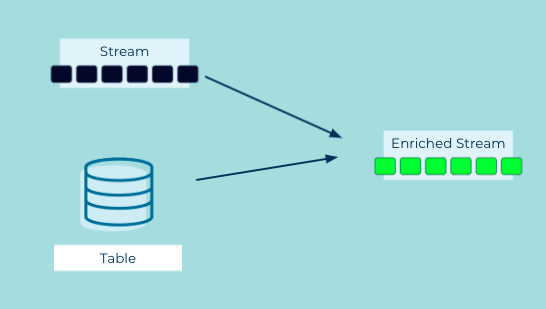

# Event Joiner

Event streams may need to join with a table or another stream to provide more comprehensive details.

## Problem

How can I enrich an event stream?

## Solution



You can combine events in a stream with another stream or table by performing a join between the two.  The join is based on a key the stream and the "other" stream or table have in common.  Also you can provide a window buffering mechanism based on timestamps so you can produce join results when events from both streams aren't immediately available.  Another approach is to join a stream and a table where the table contains more static data resulting in an enriched event stream. 


## Implementation

With ksqlDB you can create a stream of events based on a Kafka topic:

```
CREATE STREAM ratings (MOVIE_ID INT KEY, rating DOUBLE)
    WITH (kafka_topic='ratings');
```

Then create a table based on a Kafka topic that changes less frequently serving as reference data

```
CREATE TABLE movies (ID INT PRIMARY KEY, title VARCHAR, release_year INT)
    WITH (kafka_topic='movies');

```

To create a stream of enriched events perform a join between the stream and the table

```
SELECT ratings.movie_id AS ID, title, release_year, rating
   FROM ratings
   LEFT JOIN movies ON ratings.movie_id = movies.id
   EMIT CHANGES;

```

## Considerations

In ksqlDB joins between a stream and a table are driven by the stream side of the join.  Updates to the table only update the state the table.  It's the new event in the stream that results in a new join result.  You can perform an inner or left-outer join between a stream and a table.


## References

* [Kafka Tutorial](https://kafka-tutorials.confluent.io/join-a-stream-to-a-table/ksql.html): Join a stream and a lookup table
* [Kafka Tutorial](https://kafka-tutorials.confluent.io/join-a-stream-to-a-stream/ksql.html): Join a stream and a stream
* [Kafka Tutorial](https://kafka-tutorials.confluent.io/join-a-table-to-a-table/ksql.html): Join a table and a table
* [Kafka Tutorial](https://kafka-tutorials.confluent.io/multi-joins/ksql.html): N-way joins
* [ksqlDB documentation](https://docs.ksqldb.io/en/latest/developer-guide/joins/join-streams-and-tables/#stream-table-joins): Joins in ksqlDB