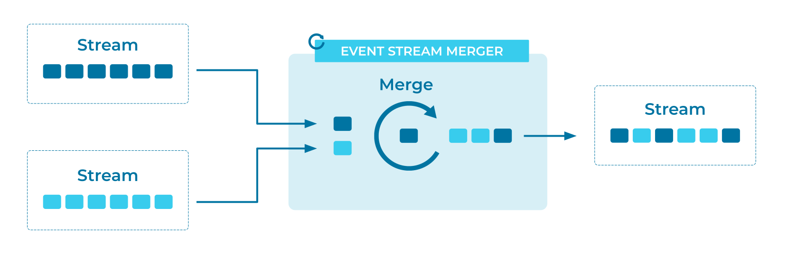

---
seo:
  title: Event Stream Merger
  description: An Event Stream Merger combines Events from multiple Event Streams into a single Event Stream, without changing the underlying data.
---

# Event Stream Merger
An [Event Streaming Application](../event-processing/event-processing-application.md) may contain multiple [Event Stream](../event-stream/event-stream.md) instances. But in some cases, it may make sense for the application to merge the separate Event Streams into a single Event Stream, without changing the individual Events. While this may seem logically related to a join, this merge is a completely different operation. A join produces results by combining Events with the same key to produce a new Event, possibly of a different type. A merge of Event Streams combines the Events from multiple Event Streams into a single Event Stream, but the individual Events are unchanged and remain independent of each other.  

## Problem
How can an application merge separate Event Streams?

## Solution



## Implementation
For Apache Kafka®, the Kafka Streams client library provides a `merge` operator in its DSL. This operator merges two Event Streams into a single Event Stream. We can then take the merged stream and perform any number of operations on it.

```java
KStream<String, Event> eventStream = builder.stream(...);
KStream<String, Event> eventStreamII = builder.stream(...);
KStream<String, Event> allEventsStream = eventStream.merge(eventStreamII);

allEventsStream.groupByKey()...
```

## Considerations

* Kafka Streams provides no guarantees on the processing order of records from the underlying Event Streams.
* In order for multiple Event Streams to be merged, they must use the same key and value types.

## References
* [How to merge many streams into one stream with Kafka Streams](https://kafka-tutorials.confluent.io/merge-many-streams-into-one-stream/kstreams.html)
* [How to merge many streams into one stream with ksqlDB](https://kafka-tutorials.confluent.io/merge-many-streams-into-one-stream/ksql.html)


