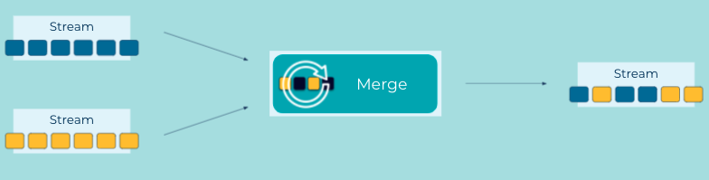

---
seo:
  title: Event Stream Merger
  description: An Event Stream Merger combines events from multiple streams into a single stream, without changing the underlying data.
---

# Event Stream Merger
An [Event Streaming Application](../event-processing/event-processing-application.md) may contain multiple [Event Stream](../event-stream/event-stream.md) instances.  But in some cases it may make sense for the application to merge the different event streams into a single event stream, without changing the individual events.  While this may seem logically related to a join, the merge is a completely different operation.  A join produces results by combining events with the same key to produce a new event, possibly of a different type.  Whereas the merge combines the events from multiple streams into a single stream, but the individual events are unchanged and remain independent of each other.  

## Problem
How can an application merge different event streams?

## Solution



## Implementation
The Kafka Streams DSL provides a `merge` operator which merges two streams into a single stream. You can then take the merged stream and use any number of operations on it.

```java
KStream<String, Event> eventStream = builder.stream(...);
KStream<String, Event> eventStreamII = builder.stream(...);
KStream<String, Event> allEventsStream = eventStream.merge(eventStreamII);

allEventsStream.groupByKey()...
```

## Considerations

* Kafka Streams provides no guarantees on the processing order of records from the underlying streams.
* When merging streams the key and value types must be the same.

## References
* [Kafka Tutorial](https://kafka-tutorials.confluent.io/merge-many-streams-into-one-stream/kstreams.html): Merging with Kafka Streams.
* [Kafka Tutorial](https://kafka-tutorials.confluent.io/merge-many-streams-into-one-stream/ksql.html): Merging streams with ksqlDB.


