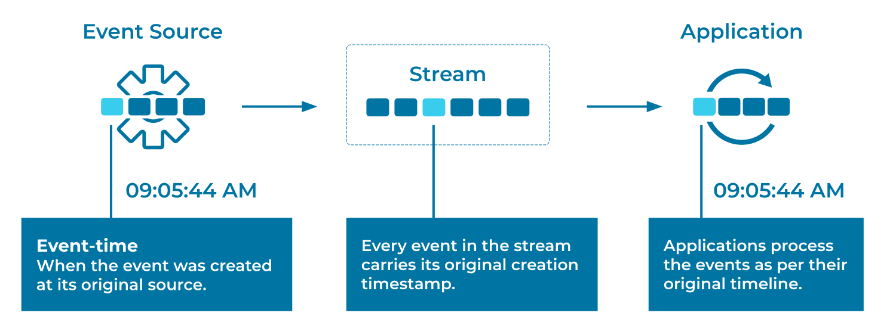

---
seo:
  title: Event-Time Processing
  description: Event-Time Processing allows an Event Streaming Application to process an Event with the timestamp of when the Event originally occurred. 
---

# Event-Time Processing

Consistent time semantics are of particular importance in stream processing. Many operations in an [Event Processor](../event-processing/event-processor.md) are dependent on time, such as joins, aggregations when computed over a window of time (for example, five-minute averages), and handling out-of-order and "late" data. In many systems, developers have a choice between different variants of time for an Event: 

1. Event-time, which captures the time at which an Event was originally created by its [Event Source](../event-source/event-source.md).
2. Ingestion-time, which captures the time at which an Event was received on the Event Stream in an [Event Streaming Platform](../event-processing/event-processing-application.md).
3. Wall-clock-time or processing-time, which is the time at which a downstream [Event Processor](../event-processing/event-processor.md) happens to process the Event (potentially milliseconds, hours, months, or more after event-time).

Depending on the use case, developers need to pick one variant over the others.

## Problem

How can we implement event-time based processing of Events (i.e., processing based on each Event's original timeline)?

## Solution



For event-time processing, the [Event Source](../event-source/event-source.md) must include a timestamp in each Event (for example, in a data field or in header metadata) that denotes the time at which the Event was created by the Event Source. Then, on the consuming side, the [Event Processing Application](../event-processing/event-processing-application.md) needs to extract this timestamp from the Event. This allows the application to process Events based on their original timeline.

## Implementation

### Apache Flink®

In Flink, streaming applications based on [event-time processing](https://nightlies.apache.org/flink/flink-docs-stable/docs/concepts/time/) require that event time watermarks be specified. Watermarks are used to signal and track the passage of time and can be used to implement grace periods for handling or dropping late events.

For example, the following Flink SQL table definition defines a [watermark strategy](https://nightlies.apache.org/flink/flink-docs-stable/docs/dev/table/sql/create/#watermark) so that the watermarks emitted are the maximum observed event timestamp minus 30 seconds. This delayed watermark strategy effectively allows events to be up to 30 seconds later than events seen so far.

```sql
CREATE TABLE orders (
    order_id INT,
    item_id INT,
    ts TIMESTAMP(3),
    WATERMARK FOR ts AS ts - INTERVAL '30' SECOND
);
```

### Kafka Streams

The Kafka Streams client library of Apache Kafka provides a `TimestampExtractor` interface for extracting the timestamp from Events. The default implementation retrieves the timestamp from the Kafka message (see the discussion above) as set by the producer of the message. Normally, this setup results in event-time processing, which is what we want.

But for those cases where we need to get the timestamp from the event payload, we can create our own `TimestampExtractor` implementation:

```java
class OrderTimestampExtractor implements TimestampExtractor {
@Override
public long extract(ConsumerRecord<Object, Object> record, long partitionTime) {
    ElectronicOrder order = (ElectronicOrder)record.value();
    return order.getTime();
}

```

Generally speaking, this functionality of custom timestamp assignment makes it easy to integrate data from other applications that are not using Kafka Streams.

Additionally, Kafka has the notion of event-time vs. processing-time (wall-clock-time) vs. ingestion time. Clients such as Kafka Streams make it possible to select which variant of time we want to work with in our application.

## Considerations

When deciding which time semantics to use, we need to consider the problem domain. In most cases, event-time processing is the recommended option. For example, when re-processing historical Event Streams (such as for A/B testing, for training machine learning models), only event-time processing yields correct results. If we use processing-time (wall-clock time) to process the last four weeks' worth of Events, then an [Event Processor](../event-processing/event-processor.md) will falsely believe that these four weeks of data were created just now in a matter of minutes, which completely breaks the original timeline and temporal distribution of the data and thus leads to incorrect processing results.

The difference between event-time and ingestion-time is typically less pronounced, but ingestion-time still suffers from the same conceptual discrepancy between when an Event actually occurred in the real world (event-time) vs. when the Event was received and stored in the [Event Streaming Platform](../event-processing/event-processing-application.md) (ingestion-time). If, for some reason, there is a significant delay between when an Event is captured and when it is delivered to the Event Streaming Platform, then event-time is the better option.

One reason not to use event-time is if we cannot trust the [Event Source](../event-source/event-source.md) to provide us with reliable data, including reliable embedded timestamps for Events. In this case, ingestion-time may be the preferred option, if it is not feasible to fix the root cause (unreliable Event sources).

## References
* See also the [Wall-Clock-Time Processing](../stream-processing/wallclock-time.md) pattern, which provides further details about using current time (wall-clock time) as the event time.
