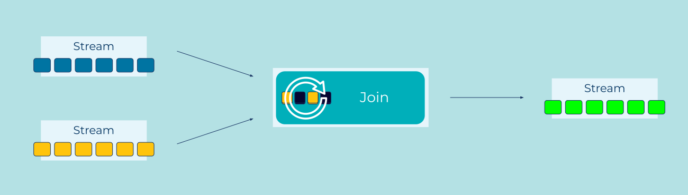

---
seo:
  title: Logical AND
  description: Logical AND of two or more event streams, synthesizing a new event using stream joins.
---

# Logical AND

[Event Streams](../event-stream/event-stream.md) become more interesting when
they're considered together. It's often the case that when two separate
[Events](../event/event.md) occur, it triggers a new fact that we want to
capture.

A product can only be dispatched when there's an order *and* a
successful payment. If someone places a bet *and* their horse wins,
then we transfer money to them.

How do we combine information from several different event streams and use them
to make new events?

## Problem

How can an application trigger processing when two (or more) related
events arrive on different streams?

## Solution


Multiple streams of events can be joined together, similar to joins in
a relational database. We watch the streams and remember their most
recent events (e.g., via an in-memory cache, a local or network
storage device) for a certain amount of time. Whenever a new event
arrives, we consider it alongside the other recently-captured events
and look for matches. If we find one, we emit a new event.

For stream-stream joins, it's important to think about what we
consider to be a "recent" event. We can't join brand new events with
arbitrarily-old ones - to join potentially-infinite streams would
require potentially-infinite memory. Instead we decide on a retention
period that counts as "new enough", and only hold on to events in that
period. This is often just fine - a payment will usually happen soon
after a order is placed. If it doesn't go through within the hour, we
can reasonably expect a different process to chase the user for
updated credit card details.

## Implementation

As an example, imagine a bank that captures `logins` to their website,
and `withdrawals` from an ATM. The fraud department might be keen to
hear if the same `user_id` logs in in one country, and makes a
withdrawal in a different country, within the same day. (This would
not necessarily be fraud, but it's certainly suspicious!)

To implement this example, we'll use ksqlDB. We start with two event streams:

```sql
-- For simplicity's sake, we'll assume that IP addresses 
-- have already been converted into country codes.

CREATE OR REPLACE STREAM logins (
  user_id BIGINT,
  country_code VARCHAR
) WITH (
  KAFKA_TOPIC = 'logins_topic',
  VALUE_FORMAT = 'AVRO',
  PARTITIONS = 3
);

CREATE OR REPLACE STREAM withdrawals (
  user_id BIGINT,
  country_code VARCHAR,
  amount DECIMAL(10,2),
  success BOOLEAN
) WITH (
  KAFKA_TOPIC = 'withdrawals_topic',
  VALUE_FORMAT = 'AVRO',
  PARTITIONS = 3
);
```

We can now join those two streams. Events with the same `user_id` are
considered equal, and we'll specifically look at events that happen
`WITHIN 1 DAY`:

```sql
CREATE STREAM possible_frauds
  AS
    SELECT l.user_id, l.country_code, w.country_code, w.amount, w.success
    FROM logins l JOIN withdrawals w
      WITHIN 1 DAY
      ON l.user_id = w.user_id
    WHERE l.country_code != w.country_code
    EMIT CHANGES;
```

Querying that stream in one terminal:

```sql
SELECT *
FROM possible_frauds
EMIT CHANGES;
```

...and inserting some data in another:

```sql
INSERT INTO logins (user_id, country_code) VALUES (1, 'gb');
INSERT INTO logins (user_id, country_code) VALUES (2, 'us');
INSERT INTO logins (user_id, country_code) VALUES (3, 'be');
INSERT INTO logins (user_id, country_code) VALUES (2, 'us');

INSERT INTO withdrawals (user_id, country_code, amount, success) VALUES (1, 'gb', 10.00, true);
INSERT INTO withdrawals (user_id, country_code, amount, success) VALUES (1, 'au', 250.00, true);
INSERT INTO withdrawals (user_id, country_code, amount, success) VALUES (2, 'us', 50.00, true);
INSERT INTO withdrawals (user_id, country_code, amount, success) VALUES (3, 'be', 20.00, true);
INSERT INTO withdrawals (user_id, country_code, amount, success) VALUES (2, 'fr', 20.00, true);
```

Results in a stream of possible fraud cases that need further investigation:

```
+-----------+----------------+----------------+--------+---------+
|L_USER_ID  |L_COUNTRY_CODE  |W_COUNTRY_CODE  |AMOUNT  |SUCCESS  |
+-----------+----------------+----------------+--------+---------+
|1          |gb              |au              |250.00  |true     |
|2          |us              |fr              |20.00   |true     |
|2          |us              |fr              |20.00   |true     |
```

## Considerations

Joining event streams is fairly simple. The big consideration is how
large a retention period you need, and so the resources your join will
use. Planning that tradeoff requires careful consideration of the
specific problem you're solving.

For large retention periods, consider joining a stream to a
[Projection Table](../table/projection-table.md) instead.

## References

See also: 

* [Joining Streams and Tables](https://docs.ksqldb.io/en/latest/developer-guide/joins/join-streams-and-tables/) in the ksqlDB documentation.
* The [Pipeline](../compositional-patterns/pipeline.md) pattern, for considering events in series (rather than in parallel).
* The [Projection Table](../table/projection-table.md) pattern, for a memory-efficient way of considering a stream over a potentially-infinite time-period.
* [Designing Event Driven Systems](https://www.confluent.io/designing-event-driven-systems/), chapter 14 for further discussion.
