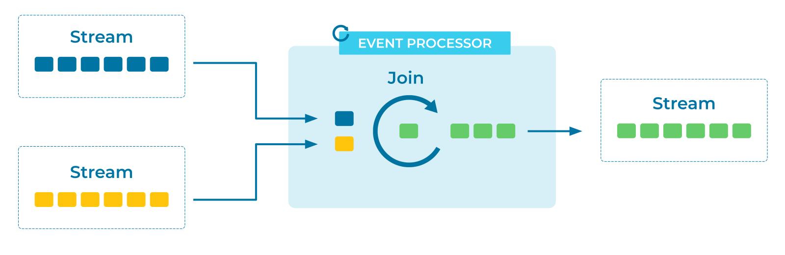

---
seo:
  title: Logical AND
  description: The Logical AND of two or more Event Streams synthesizes a new Event using stream joins.
---

# Logical AND

[Event Streams](../event-stream/event-stream.md) become more interesting when
they're considered together. Often, when two separate
[Events](../event/event.md) occur, that triggers a new fact that we want to
capture. A product can only be dispatched when there's an order *and* a
successful payment. If someone places a bet *and* their horse wins,
then we transfer money to them.

How can we combine information from several different Event Streams and use it
to create new Events?

## Problem

How can an application trigger processing when two or more related
Events arrive on different Event Streams?

## Solution


Multiple streams of Events can be joined together, similar to joins in
a relational database. We watch the Event Streams and remember their most
recent Events (for example, via an in-memory cache, or a local or network
storage device) for a certain amount of time. Whenever a new Event
arrives, we consider it alongside the other recently-captured Events,
and look for matches. If we find one, we emit a new Event.

For stream-stream joins, it's important to think about what we
consider a "recent" Event. We can't join brand new Events with
arbitrarily-old ones; to join potentially-infinite streams would
require potentially-infinite memory. Instead, we decide on a retention
period that counts as "new enough", and only hold on to Events during that
period. This is often just fine -- for example, a payment will usually happen soon
after an order is placed. If it doesn't go through within the hour, we
can reasonably expect a different process to chase the user for
updated payment details.

## Implementation

As an example, imagine a bank that captures `logins` to its website,
and `withdrawals` from an ATM. The fraud department might be keen to
hear if the same `user_id` logs in to the website in one country, and makes a
withdrawal in a different country, within the same day. (This would
not necessarily be fraud, but it's certainly suspicious!)

To implement this example, we'll use [Apache Flink® SQL](https://nightlies.apache.org/flink/flink-docs-stable/docs/dev/table/sql/gettingstarted/). We start with two Event Streams:

```sql
-- For simplicity's sake, we'll assume that IP addresses 
-- have already been converted into country codes.

CREATE TABLE logins (
  user_id BIGINT NOT NULL,
  country_code STRING
);

CREATE TABLE withdrawals (
  user_id BIGINT NOT NULL,
  country_code VARCHAR,
  amount DECIMAL(10,2),
  success BOOLEAN
);
```

We can now join these two Event Streams. Events with the same `user_id` are considered logins by the same person:

```sql
CREATE STREAM possible_frauds AS
    SELECT l.user_id, l.country_code, w.country_code, w.amount, w.success
    FROM logins l
    JOIN withdrawals w
    ON l.user_id = w.user_id
    WHERE l.country_code <> w.country_code;
```

Query that table in one terminal:

```sql
SELECT * FROM possible_frauds;
```

Insert some data into the `logins` and `withdrawals` tables in another terminal:

```sql
INSERT INTO logins VALUES
    (1, 'gb'),
    (2, 'us'),
    (3, 'be'),
    (2, 'us');

INSERT INTO withdrawals VALUES
    (1, 'gb', 10.00, true),
    (1, 'au', 250.00, true),
    (2, 'us', 50.00, true),
    (3, 'be', 20.00, true),
    (2, 'fr', 20.00, true);
```

This produces a stream of possible fraud cases that need further investigation:

```
    user_id     country_code    country_code0       amount success
          1               gb               au       250.00    TRUE
          2               us               fr        20.00    TRUE
          2               us               fr        20.00    TRUE
```

## Considerations

Joining Event Streams is fairly simple. The big consideration is how
long of a retention period we need, and by extension, the amount of resources that our join will
use. Planning that tradeoff requires careful consideration of the
specific problem that we're solving.

For long retention periods, consider joining an Event Stream to a
[Projection Table](../table/projection-table.md) instead.

## References

* See also the [Pipeline](../compositional-patterns/pipeline.md) pattern, used for considering Events in series (rather than in parallel).
* See also the [Projection Table](../table/projection-table.md) pattern, a memory-efficient way of considering an Event Stream over a potentially-infinite time period.
* See chapter 14 of [Designing Event-Driven Systems](https://www.confluent.io/designing-event-driven-systems/) for further discussion.
