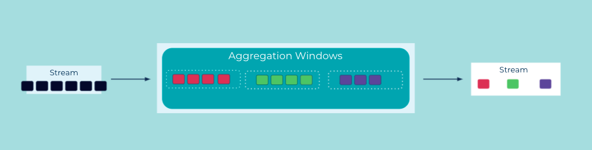

# Suppressed Event Aggregator
An [Event Streaming Application](../event-processing/event-processing-application.md) can perform continuous aggregation operations like an [Event Aggregator](event-aggregator.md).  If the input data is not windowed (cf. [Event Grouper](../stream-processing/event-grouper.md)), the aggregator will emit "intermediate" processing results. That's because an event stream is potentially infinite, so generally we do not know when the input is considered "complete". So, with few exceptions, there's not really a point where we can have a "final" result.  

However, if the input data is windowed (e.g., the input is grouped into 5-minute windows in order to compute 5-minute averages), then emitting a "final" result per window is possible, because the aggregator knows when the input for a given window is considered complete, and thus it can be configured to suppress "intermediate" results until the window time passes.


## Problem
How can an event aggregator provide a final aggregation result, rather than "intermediate" results that keep being updated?

## Solution


First, the input events of the aggregator must be windowed via an [Event Grouper](../stream-processing/event-grouper.md), i.e., the events are being grouped into "windows" based on their timestamps. Depending on the configured grouping, an event is placed exclusively into a single window, or it can be placed into multiple windows.
Then, the event aggregator performs its operation on each window. 

Only once the window is considered to have "passed" (e.g., a 5-minute window starting at 09:00am and ending at 09:05am) will the aggregator output a single, final result for this window. For example, consider an aggregation for an event stream of customer payments, where we want to compute the number of payments per hour.  By using a window size of 1 hour, we can emit a final count for the hourly number of payments once the respective 1-hour window closes.

Ideally, the aggregator is able to handle out-of-order or "late" events, which is a common situation to deal with in an event streaming platform (e.g., an event created at 09:03 arrives only at 09:07). Here, a common technique is to let users define a so-called _grace period_ for windows to give delayed events some extra time to arrive. Events that arrive within the grace period of a window will be processed, whereas any later events will be not be processed (e.g., if the grace period is 3 minutes, then the 09:03 event arriving at 09:07 would be included in the 09:00-09:05 window; any events arriving at or after 09:08 would be ignored by this window). 

Note that the use of a grace period increases the processing latency, because the aggregator has to wait for an additional period of time before it knows the input for a given window is complete and thus before it can output the single, final result for that window.


## Implementation
For Apache Kafka®, the [Kafka Streams client library](https://docs.confluent.io/platform/current/streams/index.html) provides a `suppress` operator in its DSL, which we can apply to windowed aggregations.

In the following example we compute hourly aggregations on a stream of orders, using a grace period of five minutes to wait for any orders arriving with a slight delay. The `suppress` operator ensures that there's only a single result event for each hourly window.

```java
KStream<String, OrderEvent> orderStream = builder.stream(...);

 orderStream.groupByKey()
            .windowedBy(TimeWindows.of(Duration.ofHours(1)).grace(Duration.ofMinutes(5)))
            .aggregate(() -> 0.0 /* initial value of `total`, per window */,
                       (key, order, total) -> total + order.getPrice(),
                       Materialized.with(Serdes.String(), Serdes.Double()))
            .suppress(untilWindowCloses(unbounded()))
            .toStream()
            .map((windowKey, value) -> KeyValue.pair(windowKey.key(),value))
            .to(outputTopic, Produced.with(Serdes.String(), Serdes.Double()));
```

## Considerations

* To honor the contract of outputting only a single result per window, the suppressed aggregator typically buffers events in some way until the window closes.  If its implementation uses an in-memory buffer, then, depending on the number of events per window and their payload sizes, there's the risk to run into out-of-memory errors.

## References
* The tutorial [Emit a final result from a time window with Kafka Streams](https://kafka-tutorials.confluent.io/window-final-result/kstreams.html) provides more details about the `suppress` operator.

