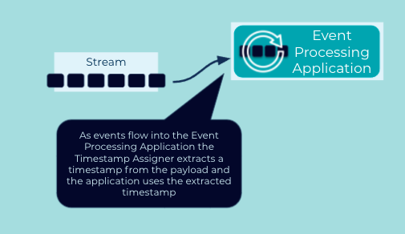

# Timestamp Assigner

## Problem

Timestamps are a critical component of stream processing framework as they impact processing order and will drive the behvior of stateful operations such as joins or windowed aggregations.  Depending on the use case it may be desired to extract a timestamp embedded in the event payload vs. using a timestamp assciated with the event itself.  Event timestamps are usually assigned by the stream processing application during the ingestion phase.

## Solution Pattern



Implement timestamp-extractor in the event processing application that understands the structure of the event payload and knows which field to extract to use for the timestamp.  Since the event processing application will most likely use a long datatype to represent the timestamp and the field could be stored as a long value or a logical date type the timestamp-extractor implementation should convert the extracted value to a long before returning it to the event processing application.

## Example Implementation

Every record in ksqlDB has system-column named `ROWTIME` representing the timestamp for the event.  The `ROWTIME` column gets the timestamp from the underlying `ConsumerRecord`.  To use a timestamp in the event payload itself you can add a `WITH(TIMESTAMP='some-field')` which ksqlDB will then get the timestamp from the specified field on the record.

```
CREATE STREAM MY_EVENT_STREM
    WITH (KAFKA_TOPIC='events',
          TIMESTAMP='eventTime');

```

## Considerations

When using the `WITH(TIMESTAMP='some-field)` clause the underlying field needs to be a type of long (64-bit) representing a Unix epoch time in milliseconds.  If the event stores the timestamp as a Date or Instant, you'll need to implement a user-defined-function (UDF) that can covert the field from its stored format to the required long one.

## References

* [Timestamp assignment in ksqlDB](https://docs.ksqldb.io/en/latest/concepts/time-and-windows-in-ksqldb-queries/#timestamp-assignment)