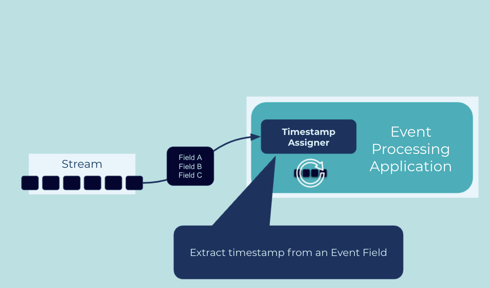

---
seo:
  title: Timestamp Assigner
  description: Timestamps are a critical component of a stream processing application and in some cases it's necessary to extract the timestamp from the event record's payload
---

# Timestamp Assigner

Consistent time semantics are of particular importance in stream processing. Many operations in an [Event Processor](../event-processing/event-processor.md) are dependent on time, such as joins, aggregations when computed over a window of time (e.g., 5-minute averages), and the handling out-of-order and "late" data. In many systems, developers have the choice between different variants of time for an event: 

1. Event-time, which captures the time at which an event was originally created by its [Event Source](../event-source/event-source.md).
2. Ingestion-time, which captures the time an event was received on the event stream in an [Event Streaming Platform](../event-processing/event-processing-application.md).
3. Wallclock-time or processing-time, which is the time at which a downstream [Event Processor](../event-processing/event-processor.md) happens to process the event (which can be milliseconds, hours, months, etc. after event-time).

Depending on the use case, developers need to pick one variant over the others.

## Problem

How do I extract an event's timestamp from a field of the event, i.e., from its payload?


## Solution



Implement a timestamp assigner, also called a timestamp extractor, in the [Event Processing Application](../event-processing/event-processing-application.md) that understands the structure of the event payload and knows which field to extract to use for the event's timestamp. The extractor must return the timestamp in a data type (e.g., `Long` or `Date`) that can be understood by the application.

## Implementation

Every record in ksqlDB has system-column named `ROWTIME` representing the timestamp for the event.  To use a timestamp in the event payload itself you can add a `WITH(l='some-field')` which instructs ksqlDB to then get the timestamp from the specified field in the record.

```
CREATE STREAM my_event_stream
    WITH (kafka_topic='events',
          timestamp='eventTime');

```

## Considerations

Depending on your use case you may find that ingestion-time or processing-time is sufficient.  Implementing a timestamp assigner is required in cases where you need event-time processing.


## References

* [Timestamp assignment in ksqlDB](https://docs.ksqldb.io/en/latest/concepts/time-and-windows-in-ksqldb-queries/#timestamp-assignment)
* See the tutorial [Event-time semantics in ksqlDB]( https://kafka-tutorials.confluent.io/time-concepts/ksql.html) for further details on time concepts