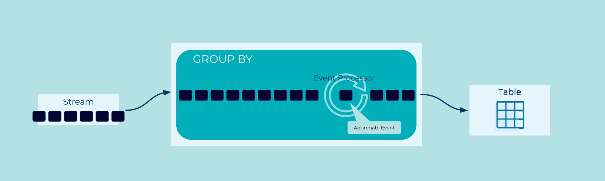

---
seo:
  title: Wait for N Events
  description: Waiting for N events in a stream.
---

# Wait for N Events

How can an application wait for a certain number of events to occur
before performing processing?

## Problem

Sometimes events become significant after they've happened several
times.

A user can try to log in 5 times, but after that we'll lock their
account.  A parcel delivery will be attempted 3 times before asking
the customer to collect it from the depot. A gamer gets a trophy after
they've killed their 100th Blarg.

How do we efficiently watch for logically similar events?

## Solution


To consider related events as a group, we need to group them by a given key,
and then count the occurrences of that key.

## Implementation

In KSQL we can easily create a table that groups and counts events by
a particular key.

As an example, imagine we are handling very large financial
transactions. We only want to process them once they've been reviewed
and approved by 2 managers.

We'll start with a stream of signed events from managers:

```sql
CREATE OR REPLACE STREAM trade_reviews (
  trade_id BIGINT,
  manager_id VARCHAR,
  signature VARCHAR,
  approved BOOLEAN
) WITH (
  kafka_topic = 'trade_reviews_topic',
  value_format = 'AVRO',
  partitions = 2
);
```

We'll group reviews by their `trade_id`, and `count` how many
 approvals (`approved = TRUE`) we see for each:

```sql
CREATE OR REPLACE TABLE trade_approval AS
  SELECT trade_id, count(*) AS approvals
  FROM trade_reviews
  WHERE approved = TRUE
  GROUP BY trade_id;
```

Querying that stream in one terminal:
```
SELECT *
FROM trade_approval
WHERE approvals = 2
EMIT CHANGES;
```

...and inserting some data in another:

```ksql
INSERT INTO trade_reviews ( trade_id, manager_id, signature, approved )
  VALUES (1, 'alice', '6f797a', TRUE);
INSERT INTO trade_reviews ( trade_id, manager_id, signature, approved )
  VALUES (2, 'alice', 'b523af', TRUE);
INSERT INTO trade_reviews ( trade_id, manager_id, signature, approved )
  VALUES (3, 'alice', 'fe1aaf', FALSE);
INSERT INTO trade_reviews ( trade_id, manager_id, signature, approved )
  VALUES (4, 'alice', 'f41bf3', TRUE);

INSERT INTO trade_reviews ( trade_id, manager_id, signature, approved )
  VALUES (2, 'bob', '0441ed', TRUE);
INSERT INTO trade_reviews ( trade_id, manager_id, signature, approved )
  VALUES (4, 'bob', '50f237', TRUE);

INSERT INTO trade_reviews ( trade_id, manager_id, signature, approved )
  VALUES (1, 'carol', 'ee52f5', FALSE);
INSERT INTO trade_reviews ( trade_id, manager_id, signature, approved )
  VALUES (3, 'carol', '4adb7c', TRUE);
```

Results in a stream of trades that are ready to process:

```
+----------+-----------+
|TRADE_ID  |APPROVALS  |
+----------+-----------+
|2         |2          |
|4         |2          |
```

## Considerations

Note that in the example above, we queried for an exact number of
approvals `WHERE approvals = 2`. We could have used a
greater-than-or-equal check (`WHERE approvals >= 2`) but that would
have emitted a new event for a 3rd approval, and a 4th, and so on.
That would be the wrong behavior here, but it might be useful feature
in a system where you wanted to reward loyal customers, and send out a
discount email for every order _after_ their first 10.

## References

* The [Event Aggregator](../stream-processing/event-aggregator.md) pattern, for a more general consideration of `GROUP BY` operations.
* [Designing Event Driven Systems](https://www.confluent.io/designing-event-driven-systems/), chapter 15 for further discussion.
