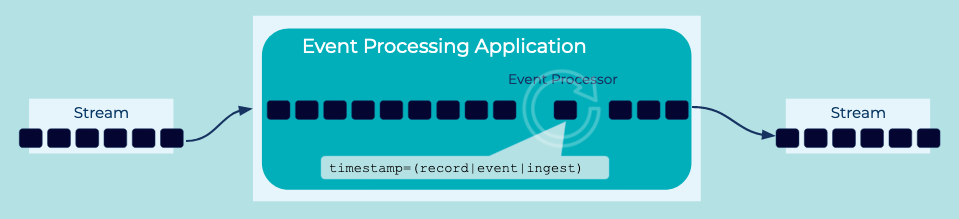

# Wallclock-Time Processing
Consistent time semantics are important in stream processing, especially for time-based aggregations when calculating over a window of time.

## Problem
How do I process events from an [Event Source](../event-source/event-source.md) irrespective of the timestamps when they were created originally at the source.

## Solution


Depending on the use case, [Event Processors](../event-processing/event-processor.md) may use the time when the event was ingested, receive on the event stream, or from a field provided by the [Event](../event/event.md) itself.

## Implementation
```
CREATE STREAM TEMPERATURE_READINGS_EVENTTIME
    WITH (KAFKA_TOPIC='deviceEvents',
          VALUE_FORMAT='avro',
          TIMESTAMP='eventTime');
```

By default, [ksqlDB](https://ksqldb.io) `ROWTIME` is inherited from the timestamp in the underlying Kafka record metadata, but it can also be pulled from a field in the event payload itself, as shown below.


Every record in ksqlDB has a system column called `ROWTIME` that tracks the timestamp of the event. It could be either when the event occurs (producer system time) or when the event is ingested (broker system time), depending on the `message.timestamp.type` configuration value. ksqlDB also allows streams to use the timestamp from a field in the record payload.


## References
* See the [ksqlDB documentation](https://docs.ksqldb.io/en/latest/concepts/time-and-windows-in-ksqldb-queries/#time-semantics) on time semantics
* See this [Kafka Tutorial](https://kafka-tutorials.confluent.io/time-concepts/ksql.html) for a full example on event-time semantics
