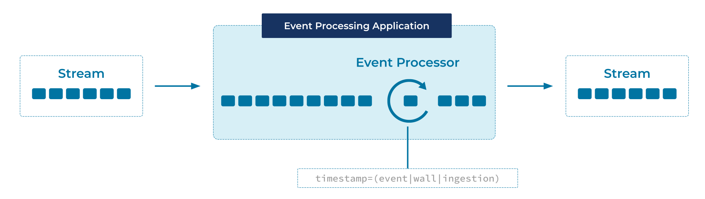

---
seo:
  title: Wallclock-Time Processing
  description: Process events from an event source, taking into account different ways to handle timestamps, wallclock time, and processing time.
---

# Wallclock-Time Processing
Consistent time semantics are of particular importance in stream processing. Many operations in an [Event Processor](../event-processing/event-processor.md) are dependent on time, such as joins, aggregations when computed over a window of time (e.g., 5-minute averages), and the handling out-of-order and "late" data. In many systems, developers have the choice between different variants of time for an event:

1. Event-time, which captures the time at which an event was originally created by its Event Source.
2. Ingestion-time, which captures the time an event was received on the event stream in an Event Streaming Platform.
3. Wallclock-time or processing-time, which is the time at which a downstream Event Processor happens to process the event (which can be milliseconds, hours, months, etc. after event-time). 

Depending on the use case, developers need to pick one variant over the others.

## Problem
How can events from an [Event Source](../event-source/event-source.md) be processed irrespective of the timestamps when they were created originally at the source?

## Solution


Depending on the use case, [Event Processors](../event-processing/event-processor.md) may use the time when the event was originally created by its [Event Source](../event-source/event-source.md), when it was received on the event stream in the [Event Streaming Platform](../event-stream/event-streaming-platform.md), or they can derive the timestamp from one or more data fields provided by the [Event](../event/event.md) itself (i.e., from the event payload).

## Implementation

As an example, the streaming database [ksqlDB](https://ksqldb.io) maintains a system column called `ROWTIME` that tracks the timestamp of the [Event](../event/event.md). By default, `ROWTIME` is inherited from the timestamp in the underlying Kafka record metadata, but it can also be pulled from a field in the [Event](../event/event.md). See [time semantics](https://docs.ksqldb.io/en/latest/concepts/time-and-windows-in-ksqldb-queries/#time-semantics) in the ksqlDB documentation for more information.

```
CREATE STREAM TEMPERATURE_READINGS_EVENTTIME
    WITH (KAFKA_TOPIC='deviceEvents',
          VALUE_FORMAT='avro',
          TIMESTAMP='eventTime');
```

## References
* The [Event-Time Processing](../stream-processing/event-time-processing.md) pattern provides the base information related to time semantics in stream processing.
* See the tutorial [Event-time semantics](https://kafka-tutorials.confluent.io/time-concepts/ksql.html) for a full example
