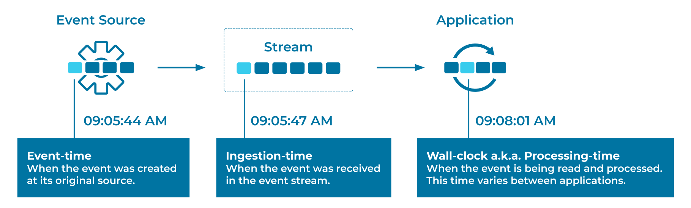

---
seo:
  title: Wallclock-Time Processing
  description: Process Events from an Event Source, taking into account different ways of handling timestamps, wall-clock time, and processing time.
---

# Wall-Clock-Time Processing
Consistent time semantics are of particular importance in stream processing. Many operations in an [Event Processor](../event-processing/event-processor.md) are dependent on time, such as joins, aggregations when computed over a window of time (e.g., five-minute averages), and handling out-of-order and "late" data. In many systems, developers have a choice between different variants of time for an [Event](../event/event.md):

1. Event-time, which captures the time at which an Event was originally created by its Event Source.
2. Ingestion-time, which captures the time at which an Event was received on the Event Stream in an [Event Streaming Platform](../event-stream/event-streaming-platform.md).
3. Wall-clock-time or processing-time, which is the time at which a downstream Event Processor happens to process an Event (potentially milliseconds, hours, months, or more after event-time). 

Depending on the use case, developers need to pick one variant over the others.

## Problem
How can Events from an [Event Source](../event-source/event-source.md) be processed irrespective of the timestamps from when they were originally created by the Event Source?

## Solution


Depending on the use case, [Event Processors](../event-processing/event-processor.md) may use the time when the Event was originally created by its [Event Source](../event-source/event-source.md), the time when it was received on the Event Stream in the [Event Streaming Platform](../event-stream/event-streaming-platform.md), or a time derived from one or more data fields provided by the [Event](../event/event.md) itself (i.e., from the Event payload).

## Implementation

As an example, [Apache Flink® SQL](https://nightlies.apache.org/flink/flink-docs-stable/docs/dev/table/sql/gettingstarted/) exposes the wall-clock processing time as a computed column using the system `PROCTIME()` function.

```sql
CREATE TABLE device_readings (
    device_id INT,
    temperature DOUBLE,
    wallclock_time AS PROCTIME()
);

SELECT device_id,
    COUNT(*) AS reading_count,
    window_start,
    window_end
FROM TABLE(TUMBLE(TABLE device_readings, DESCRIPTOR(wallclock_time), INTERVAL '5' MINUTES))
GROUP BY device_id, window_start, window_end;
```

## References
* The [Event-Time Processing](../stream-processing/event-time-processing.md) pattern provides basic information about time semantics in stream processing.
