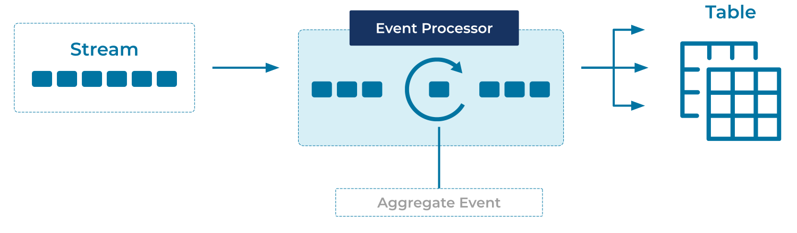

---
seo:
  title: Projection Table
  description: Projection tables act like a materialized view of an event stream or change log, grouping and summarizing the events into a unified state.
---

# Projection Table

How can a stream of change events be summarized into the current state
of the world, efficiently?

## Problem

One of the first questions we want to ask of a stream of events is,
"Where are we now?"

We have a stream of sales events, we'd like to have the total sales
figures at our fingertips. We have a stream of `login` events, we'd
like to know when each user last logged in. Our trucks send GPS data
every minute, we'd like to know where each truck is right now.

How do we roll up data efficiently? How do we preserve a complete
event log and enjoy the fast queries of an "update in place"-style
database?

## Solution


We can maintain summary tables that behave just like materialized
views in a traditional database. As new events come in, the table is
automatically updated, giving us an always-live picture of the system.

## Implementation

ksqlDB supports easy creation of summary tables/materialized views. We
declare them once, and the server will maintain their data as new
events stream in.

As an example, imagine we are shipping packages around the world.  As
they reach each point on their journey, they're logged with their
current location.

We'll start with a stream of check-in events:


```sql
CREATE OR REPLACE STREAM package_checkins (
  package_id BIGINT KEY,
  location VARCHAR,
  processed_by VARCHAR
) WITH (
  kafka_topic = 'package_checkins_topic',
  value_format = 'AVRO',
  partitions = 3
);
```

Then we'll create a summary table, tracking each `package_id` and the
newest `location`:

```sql
CREATE OR REPLACE TABLE package_locations AS
  SELECT
    package_id,
    LATEST_BY_OFFSET(location) AS current_location
  FROM package_checkins
  GROUP BY package_id;
```

Querying that stream in one terminal:

```sql
SELECT *
FROM package_locations
EMIT CHANGES;
```

...and inserting some data in another:

```sql
INSERT INTO package_checkins ( package_id, location ) VALUES ( 1, 'New York' );
INSERT INTO package_checkins ( package_id, location ) VALUES ( 1, 'London' );
INSERT INTO package_checkins ( package_id, location ) VALUES ( 2, 'London' );
INSERT INTO package_checkins ( package_id, location ) VALUES ( 1, 'Paris' );
INSERT INTO package_checkins ( package_id, location ) VALUES ( 3, 'Paris' );
INSERT INTO package_checkins ( package_id, location ) VALUES ( 2, 'Paris' );
INSERT INTO package_checkins ( package_id, location ) VALUES ( 3, 'London' );
INSERT INTO package_checkins ( package_id, location ) VALUES ( 1, 'Rome' );
INSERT INTO package_checkins ( package_id, location ) VALUES ( 2, 'Rome' );
INSERT INTO package_checkins ( package_id, location ) VALUES ( 3, 'Washington' );
```

Results in a table of each package's last-known location:

```
+------------+------------------+
|PACKAGE_ID  |CURRENT_LOCATION  |
+------------+------------------+
|1           |Rome              |
|2           |Rome              |
|3           |Washington        |
```

As new data is inserted, `package_locations` stays updated, so we can
see the current location of each package without scanning through the
event history every time.

## Considerations

In the example above, it's important to consider partitioning. When we
declared the `package_checkins` stream, we marked the `package_id` as
the `KEY`. This ensures that all events with the same `package_id`
will be stored in the same partition, in turn ensuring that for a
given `package_id`, newer events have a higher `offset` value. Thus
when we query for the `LATEST_BY_OFFSET`, we're always getting the
newest event for each package. If we'd chosen a different partitioning
key, or not specified one at all, we'd get very different results.

`LATEST_BY_OFFSET` is only one of the many [summary
functions ksqlDB supports][summary_functions], from simple sums and
averages to time-aware functions and histograms. And beyond those, you can
easily [define your own custom functions][custom_functions] or look to
[Kafka Streams][kafka_streams] for complete control.

## References
* [Aggregate functions][summary_functions] in the ksqlDB documentation.
* Creating [custom ksqlDB functions][custom_functions] in the ksqlDB documentation.

[summary_functions]: https://docs.ksqldb.io/en/latest/developer-guide/ksqldb-reference/aggregate-functions/
[custom_functions]: https://docs.ksqldb.io/en/latest/concepts/functions/
[kafka_streams]: https://www.confluent.io/blog/introducing-kafka-streams-stream-processing-made-simple/
