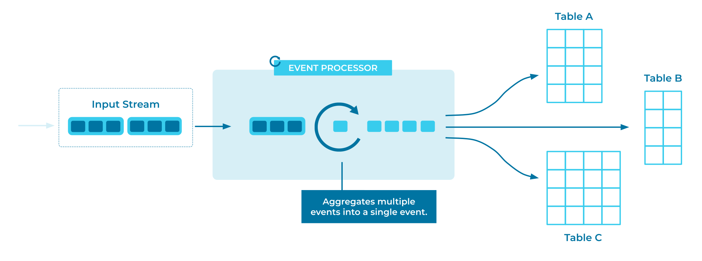

---
seo:
  title: Projection Table
  description: A Projection Table acts as a materialized view of an Event Stream or change log, grouping and summarizing events into a unified state.
---

# Projection Table

One of the first questions we want to ask of a stream of events is,
"Where are we now?"

If we have a stream of sales events, we'd like to have the total sales
figures at our fingertips. If we have a stream of `login` events, we'd
like to know when each user last logged in. If our trucks send GPS data
every minute, we'd like to know where each truck is right now.

How do we efficiently roll up data? How do we preserve a complete
event log and enjoy the fast queries of an "update-in-place" style
database?

## Problem

How can a stream of change events be efficiently summarized to give the current state
of the world?

## Solution


We can maintain a projection table that behaves just like a materialized
view in a traditional database. As new events come in, the table is
automatically updated, constantly giving us a live picture of the system.
Events with the same key are considered related; newer events are interpreted, depending on their contents, as updates to or deletions of older events.

As with a materialized view, projection tables are read-only. To change
a projection table, we change the underlying data by recording new events to the table's
underlying stream.

## Implementation

ksqlDB supports easy creation of summary tables and materialized views. We
declare them once, and the server will maintain their data as new
events stream in.

As an example, imagine that we are shipping packages around the world. As
a package reaches each point on its journey, it is logged with its
current location.

Let's start with a stream of package check-in events:


```sql
CREATE OR REPLACE STREAM package_checkins (
  package_id BIGINT KEY,
  location VARCHAR,
  processed_by VARCHAR
) WITH (
  KAFKA_TOPIC = 'package_checkins_topic',
  VALUE_FORMAT = 'AVRO',
  PARTITIONS = 3
);
```

Then we'll create a projection table, tracking each `package_id` and its
most recent `location`:

```sql
CREATE OR REPLACE TABLE package_locations AS
  SELECT
    package_id,
    LATEST_BY_OFFSET(location) AS current_location
  FROM package_checkins
  GROUP BY package_id;
```

Query that stream in one terminal:

```sql
SELECT *
FROM package_locations
EMIT CHANGES;
```

...and insert some data in another terminal:

```sql
INSERT INTO package_checkins ( package_id, location ) VALUES ( 1, 'New York' );
INSERT INTO package_checkins ( package_id, location ) VALUES ( 1, 'London' );
INSERT INTO package_checkins ( package_id, location ) VALUES ( 2, 'London' );
INSERT INTO package_checkins ( package_id, location ) VALUES ( 1, 'Paris' );
INSERT INTO package_checkins ( package_id, location ) VALUES ( 3, 'Paris' );
INSERT INTO package_checkins ( package_id, location ) VALUES ( 2, 'Paris' );
INSERT INTO package_checkins ( package_id, location ) VALUES ( 3, 'London' );
INSERT INTO package_checkins ( package_id, location ) VALUES ( 1, 'Rome' );
INSERT INTO package_checkins ( package_id, location ) VALUES ( 2, 'Rome' );
INSERT INTO package_checkins ( package_id, location ) VALUES ( 3, 'Washington' );
```

These are the results, in a table of each package's last-known location:

```
+------------+------------------+
|PACKAGE_ID  |CURRENT_LOCATION  |
+------------+------------------+
|1           |Rome              |
|2           |Rome              |
|3           |Washington        |
```

As new data is inserted, the `package_locations` table is updated, so we can
see the current location of each package without scanning through the
event history every time.

## Considerations

In the example above, it's important to consider partitioning. When we
declared the `package_checkins` stream, we marked the `package_id` as
the `KEY`. This ensures that all events with the same `package_id`
will be stored in the same partition,  which in turn means that for a
given `package_id`, newer events will always have a higher `offset` value. Thus,
when we query for the `LATEST_BY_OFFSET`, we always get the
newest event for each package. If we had chosen a different partitioning
key, or not specified a key at all, we would get very different results.

`LATEST_BY_OFFSET` is only one of the many [summary
functions supported by ksqlDB][summary_functions]. Others range from simple sums and
averages to time-aware functions and histograms. And beyond those, we can
easily [define custom functions][custom_functions], or look to
[Kafka Streams][kafka_streams] for complete control.

## References

* [Aggregate functions][summary_functions] in the ksqlDB documentation.
* Creating [custom ksqlDB functions][custom_functions] in the ksqlDB documentation.
* See also the [State Table](../table/state-table.md) pattern.

[summary_functions]: https://docs.ksqldb.io/en/latest/developer-guide/ksqldb-reference/aggregate-functions/
[custom_functions]: https://docs.ksqldb.io/en/latest/concepts/functions/
[kafka_streams]: https://www.confluent.io/blog/introducing-kafka-streams-stream-processing-made-simple/
