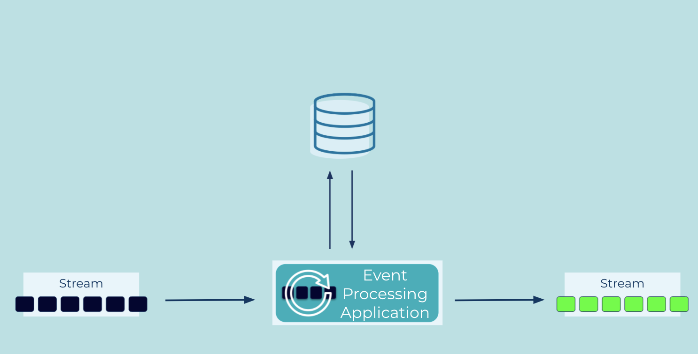

---
seo:
  title: State Table
  description: A state table allows an Event Processor to record and update state, similar to a table in a relational database.
---

# State Table
[Event Processors](../event-processing/event-processor.md) often need to perform stateful operations, such as an aggregation (e.g., counting the number of events). The state is similar to a table in a relational database and is mutable, i.e., it allows for read and write operations. It is essential that the event processor has an efficient and fault-tolerant mechanism for state management, i.e, recording and updating the state while processing input events, to ensure correctness of computations and preventing data loss as well as data duplication.


## Problem
How can an Event Processor manage (mutable) state, similar to a table in a relational database?

## Solution



We need to implement a mutable state table that allows the Event Processor to record and update state. For example, to count the number of payments per customer, the state table provides a mapping between the customer (e.g., a customer ID) and the current count of payments.

The state's storage backend can vary by implementation: options include local state stores (e.g., RocksDB), remote state stores (e.g., AWS DynamoDB or a NoSQL database), or in-memory caches. Local state stores are usually recommended as they do not incur additional latency for network roundtrips, which improves the end-to-end performance of the Event Processor.

Irrespective of backend choice, the state table should be fault-tolerant to ensure strong processing guarantees, such as exactly-once semantics. Fault-tolerance can be achieved, for example, by attaching an [Event Source Connector](../event-source/event-source-connector.md) to the state table to perform change data capture (CDC), thus allowing the Event Processor to continuously backup state changes into an [Event Stream](../event-stream/event-stream.md) and, whenever needed, restore the state table in the case of failure or similar scenarios.here is no network latency to contend with.  Also, an approach for restoring the state after a crash destroying the local store occurs.

## Implementation

ksqlDB provides state tables out of the box with its `TABLE` data collection. Its implementation uses local, fault-tolerant state stores that are continuously backed up into ksqlDB's distributed storage layer (Kafka) so the data is durable.

For example, we can maintain a stateful count of all sales with by aggregating the `movie_ticket_sales` stream into a `movie_tickets_sold` table:

```sql
CREATE TABLE movie_tickets_sold AS
    SELECT title,
           COUNT(ticket_total_value) AS tickets_sold
    FROM movie_ticket_sales
    GROUP BY title
    EMIT CHANGES;
```

## References

* [State store recovery in ksqlDB](https://www.confluent.io/blog/ksqldb-state-stores-in-recovery/) explains the fault-tolerance of ksqlDB's state management in more detail.
* Related patterns: [Projection Table](../table/projection-table.md)

