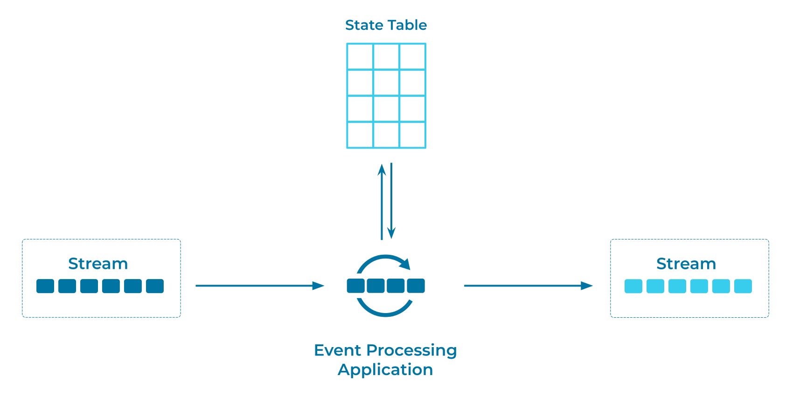

---
seo:
  title: State Table
  description: A State Table, similar to a table in a relational database, allows an Event Processor to record and update state.
---

# State Table
[Event Processors](../event-processing/event-processor.md) often need to perform stateful operations, such as an aggregation (for example, counting the number of events). The state is similar to a table in a relational database, and is mutable: it allows for read and write operations. It is essential that the event processor has an efficient and fault-tolerant mechanism for state management--for recording and updating the state while processing input events--to ensure correctness of the computations and to prevent data loss and data duplication.

## Problem
How can an Event Processor manage mutable state, similar to how a table does in a relational database?

## Solution



We need to implement a mutable state table that allows the Event Processor to record and update state. For example, to count the number of payments per customer, a state table provides a mapping between the customer (for example, a customer ID) and the current count of payments.

The state's storage backend can vary by implementation: options include local state stores (such as RocksDB), remote state stores (such as Amazon DynamoDB or a NoSQL database), and in-memory caches. Local state stores are usually recommended, as they do not incur additional latency for network round trips, and this improves the end-to-end performance of the Event Processor.

Regardless of backend choice, the state table should be fault-tolerant to ensure strong processing guarantees, such as exactly-once semantics. Fault tolerance can be achieved, for example, by attaching an [Event Source Connector](../event-source/event-source-connector.md) to the state table to perform change data capture (CDC). This allows the Event Processor to continuously back up state changes into an [Event Stream](../event-stream/event-stream.md) and to restore the state table in the case of failure or similar scenarios. There is no network latency to contend with. This also provides an approach for restoring the state after a crash that destroys the local store.

## Implementation

[Apache Flink® SQL](https://nightlies.apache.org/flink/flink-docs-stable/docs/dev/table/sql/gettingstarted/) provides state tables out of the box. For example, we can maintain a stateful count of all movie ticket sales by aggregating a base `movie_ticket_sales` table into a `movie_tickets_sold` table:

```sql
CREATE TABLE movie_tickets_sold AS
    SELECT title,
           COUNT(total_ticket_value) AS tickets_sold
    FROM movie_ticket_sales
    GROUP BY title;
```

## References

* See also the [Projection Table](../table/projection-table.md) pattern.
